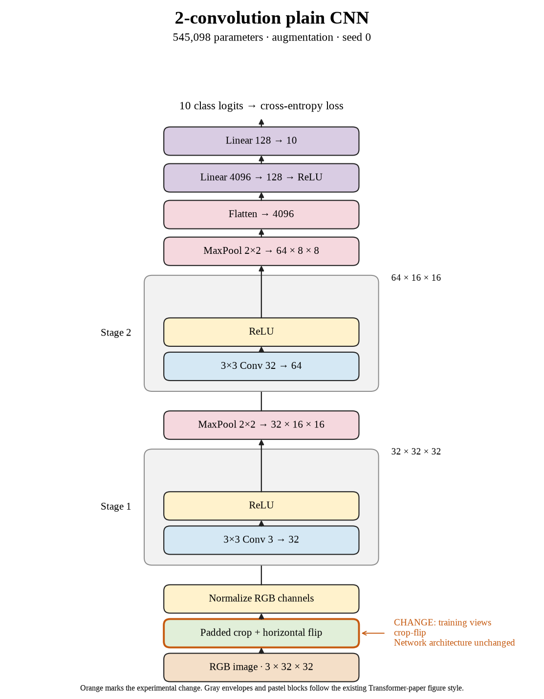

# 01. Does crop + flip improve seed 0? (Oct 1, 2026)

**TL;DR:** Crop + flip reduced the train–test gap, but it also reduced test accuracy by 1.28 percentage points.

**Problem.** I wanted to see whether changing the training images would help this small CNN recognize new images. The unaugmented model could fit its training examples better than its test examples.

*How we know:* the paired seed-0 control reached 74.01% clean training accuracy and 67.53% test accuracy. That is a 6.48-point gap. I didn't know whether augmentation would improve test accuracy or just make training harder.

**Experiment.** I added four black pixels on every side, sampled a random 32×32 crop, and flipped each image horizontally with probability 0.5. I kept batch 512, 80 epochs, and learning rate 0.01 fixed.

*What we hope to learn:* if test accuracy rises, the changing views help. If only training accuracy falls, closing the gap isn't enough.

**Outcome.** The model reached 66.75% training accuracy and 66.25% test accuracy:

- Crops move the object and can cut off its edges, like looking through a shifted window. That makes the task harder; I haven't isolated which part caused the drop.
- The gap fell to 0.50 points because training accuracy fell much more than test accuracy. Basically, two lower scores can be closer together.

I kept the predefined final-epoch result, including the 1.28-point loss against the paired control.

**Takeaway:** I can't call augmentation successful just because the gap looks better. The actual goal is higher accuracy on new images.

Source: [completed run](https://wandb.ai/7adamyasingh-rutgers-university/cifar-activity/runs/88qfok6b).

<!-- experiment-key: augmentation/crop-flip/seed-0 -->

<!-- experiment-architecture -->

Figure exports: [SVG](../../figures/experiments/augmentation-crop-flip-seed-0.svg) · [PDF](../../figures/experiments/augmentation-crop-flip-seed-0.pdf). Orange marks what changed; the diagram shows the trained architecture.
