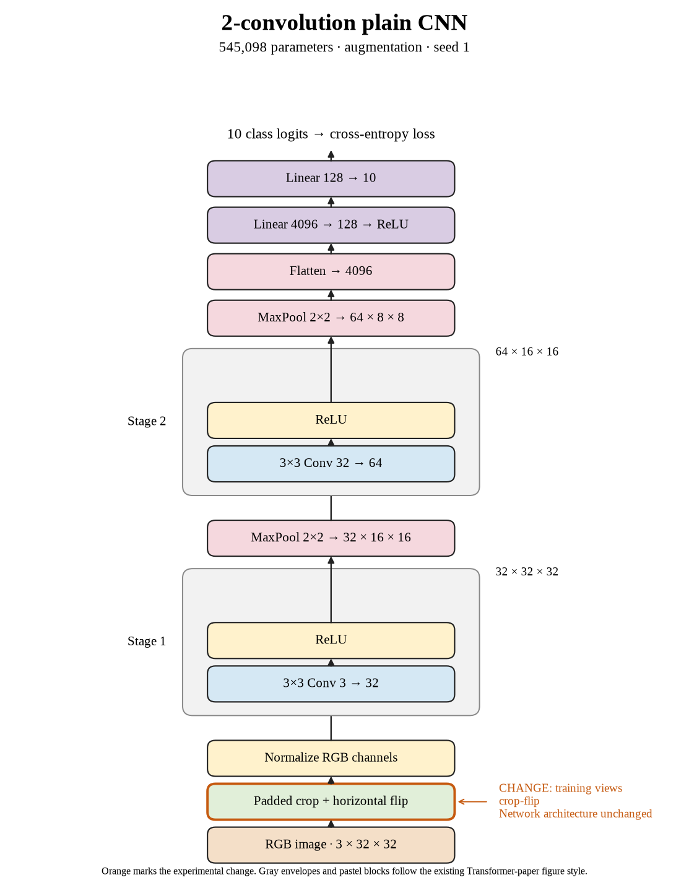

# 02. Does crop + flip help with a different seed? (Oct 1, 2026)

**TL;DR:** Seed 1 repeated the crop + flip loss: test accuracy fell by 1.80 points against its own control.

**Problem.** One run can look good or bad because of its starting weights and training order. I needed another seed, basically a different repeat of the same recipe, before blaming the augmentation.

*How we know:* seed 0 lost 1.28 points with crop + flip. The seed-1 control reached 67.25% test accuracy, so that is the comparison that matters for this repeat.

**Experiment.** I repeated four-pixel padded random crops and 50% horizontal flips with seed 1. The model, batch size, learning rate, and 80-epoch budget stayed fixed.

*What we hope to learn:* if the loss disappears, seed 0 could be an unusual run. If it repeats, the recipe deserves more scrutiny.

**Outcome.** Test accuracy reached 65.45%, below the paired control's 67.25%:

- The model also fit the clean training images worse: 66.41% versus 75.29%. Like adding harder practice questions, changing the views asks more of the same training budget.
- The gap shrank from 8.04 to 0.96 points. A smaller distance between two scores doesn't tell me whether either score improved.

I counted this as a second loss for crop + flip at the fixed budget. It doesn't tell me what longer training would do.

**Takeaway:** Repeats matter, and each repeat needs its own control. This run supports the same conclusion as seed 0 without relying on the historical baseline.

Source: [completed run](https://wandb.ai/7adamyasingh-rutgers-university/cifar-activity/runs/b8vppiqs).

<!-- experiment-key: augmentation/crop-flip/seed-1 -->

<!-- experiment-architecture -->

Figure exports: [SVG](../../figures/experiments/augmentation-crop-flip-seed-1.svg) · [PDF](../../figures/experiments/augmentation-crop-flip-seed-1.pdf). Orange marks what changed; the diagram shows the trained architecture.
