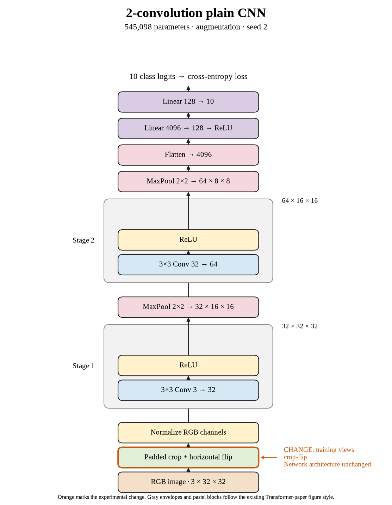

# 03. Is the crop + flip loss consistent across three seeds? (Oct 1, 2026)

**TL;DR:** Crop + flip lost in all three paired seeds, with a mean loss of 1.58 points.

**Problem.** The first two seeds agreed, but I wanted the third repeat before summarizing the recipe. A high score by itself can still hide a weak comparison.

*How we know:* the seed-2 unaugmented control reached 69.10% test accuracy, higher than the other controls. I needed to compare against that run, not pick a lower baseline.

**Experiment.** I ran the same padded crop + flip recipe with seed 2 for 80 epochs. Every seed kept the same architecture and optimizer settings.

*What we hope to learn:* if seed 2 wins, the result depends more on the seed. If it loses too, the direction is consistent across this small set of repeats.

**Outcome.** Test accuracy reached 67.45%, a 1.65-point loss against seed 2's control:

- Clean training accuracy was 68.21%, versus 76.58% without augmentation. The augmented model climbed less far on both scores, like taking a harder route in the same time.
- The gap fell from 7.48 to 0.76 points. That is evidence of reduced training fit, not evidence that test performance improved.

Across the three seeds, crop + flip averaged 66.38% test accuracy versus 67.96% for the controls. I retained all three final-epoch results.

**Takeaway:** This crop + flip recipe is worse at our current budget. I haven't shown that cropping is bad at every budget or with every padding choice.

Source: [completed run](https://wandb.ai/7adamyasingh-rutgers-university/cifar-activity/runs/fnxflfr4).

<!-- experiment-key: augmentation/crop-flip/seed-2 -->

<!-- experiment-architecture -->

Figure exports: [SVG](../../figures/experiments/augmentation-crop-flip-seed-2.svg) · [PDF](../../figures/experiments/augmentation-crop-flip-seed-2.pdf). Orange marks what changed; the diagram shows the trained architecture.
