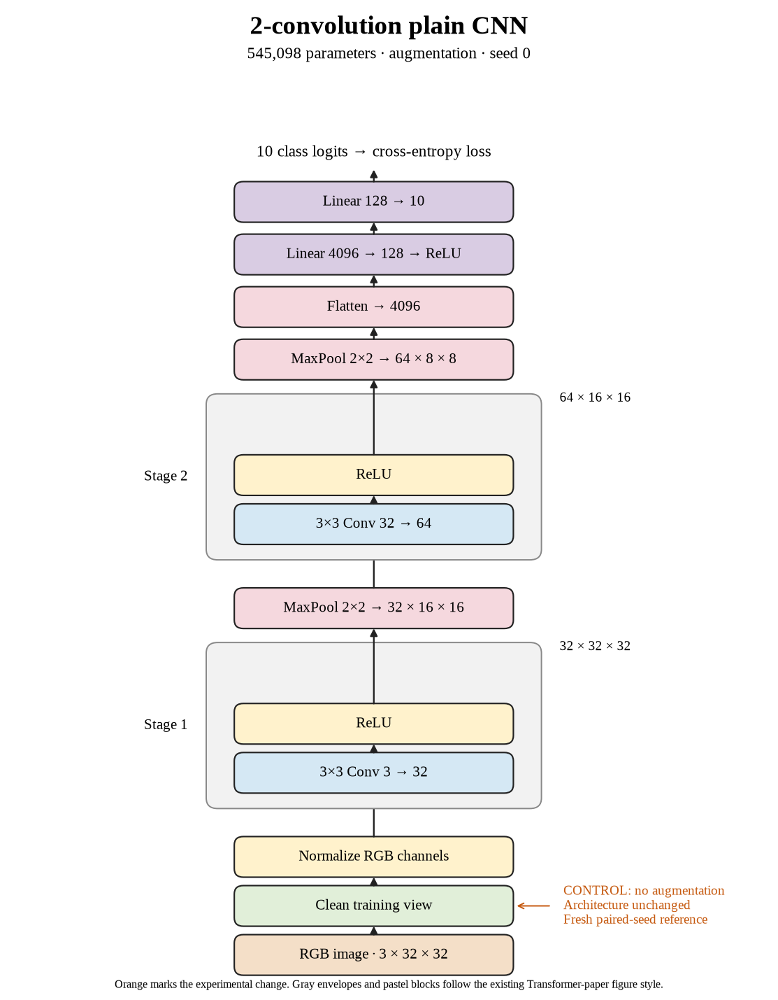

# 04. What does a fresh seed-0 control actually reach? (Oct 1, 2026)

**TL;DR:** The fresh control reached 67.53% test accuracy and gave seed 0 a fair baseline for the augmentation comparisons.

**Problem.** I already had a historical 67.67% run, but the new suite separates shuffle randomness from augmentation randomness. I wanted a control from the same suite instead of treating the old number as interchangeable.

*How we know:* the seed-0 crop + flip run reached 66.25%. Whether that is an improvement depends on what the matching unaugmented run reaches.

**Experiment.** I trained seed 0 without augmentation, using the suite's shared initialization and shuffle settings. Batch 512, learning rate 0.01, and 80 epochs stayed fixed.

*What we hope to learn:* if the control reproduces roughly the historical performance, it provides a useful reference. If it changes substantially, I need to account for that before interpreting augmentation.

**Outcome.** The model reached 74.01% clean training accuracy and 67.53% test accuracy:

- Training accuracy exceeded test accuracy by 6.48 points, like doing better on familiar practice questions than on new ones. That leaves room to investigate generalization.
- The historical score and this score differ by 0.14 points. They're separate repeats, like two measurements with slightly different starting conditions.

I used 67.53% as seed 0's control. I didn't substitute the historical result.

**Takeaway:** The control is part of the experiment. A fair comparison starts with the run that actually matches the treatment's conditions.

Source: [completed run](https://wandb.ai/7adamyasingh-rutgers-university/cifar-activity/runs/9vwqhv9t).

<!-- experiment-key: augmentation/none/seed-0 -->

<!-- experiment-architecture -->

Figure exports: [SVG](../../figures/experiments/augmentation-none-seed-0.svg) · [PDF](../../figures/experiments/augmentation-none-seed-0.pdf). Orange marks what changed; the diagram shows the trained architecture.
