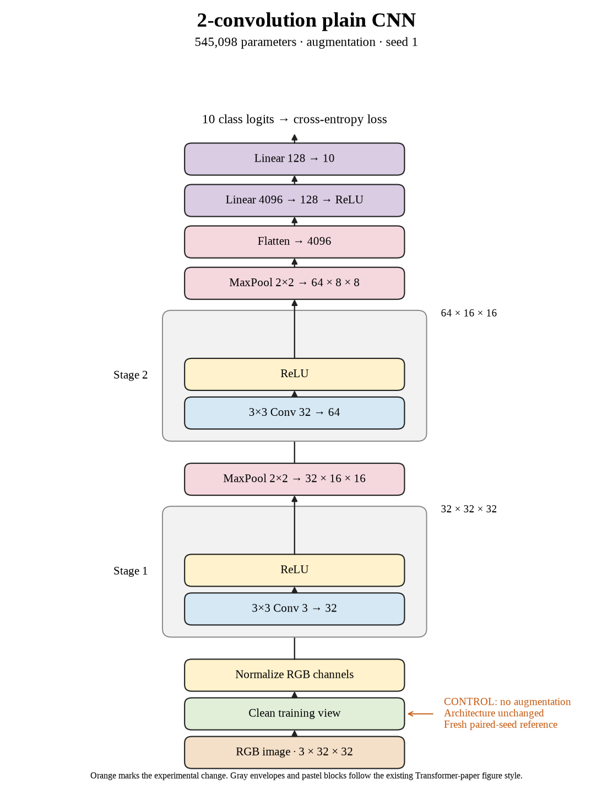

# 05. How much does the unaugmented control change with seed 1? (Oct 1, 2026)

**TL;DR:** Seed 1 reached 67.25% test accuracy despite fitting the training set better than seed 0.

**Problem.** I wanted to measure the variation we get without changing the recipe. Otherwise, a change caused by the seed could get credited to augmentation.

*How we know:* the seed-0 control reached 67.53% test accuracy. I still needed the matching seed-1 reference for its augmented runs.

**Experiment.** I repeated the unaugmented batch-512, 80-epoch recipe with seed 1. This changed initialization and sample order while keeping the training recipe fixed.

*What we hope to learn:* if the controls vary, I should compare treatments within each seed. If they are nearly identical, comparisons are easier, but repeats still matter.

**Outcome.** Training accuracy reached 75.29%, while test accuracy reached 67.25%:

- This run fit familiar images better than seed 0 but scored worse on new ones. Like rehearsing the practice sheet, better recall doesn't guarantee better transfer.
- Its 8.04-point gap was larger than seed 0's. The seed changes the path through training, like starting the same hike from a different trailhead.

I used this run as seed 1's control. Flip-only later beat it by 1.37 points; crop + flip lost 1.80 points.

**Takeaway:** Higher training accuracy alone doesn't settle which model is better. I care about test accuracy and comparisons against the matching control.

Source: [completed run](https://wandb.ai/7adamyasingh-rutgers-university/cifar-activity/runs/132c95yo).

<!-- experiment-key: augmentation/none/seed-1 -->

<!-- experiment-architecture -->

Figure exports: [SVG](../../figures/experiments/augmentation-none-seed-1.svg) · [PDF](../../figures/experiments/augmentation-none-seed-1.pdf). Orange marks what changed; the diagram shows the trained architecture.
