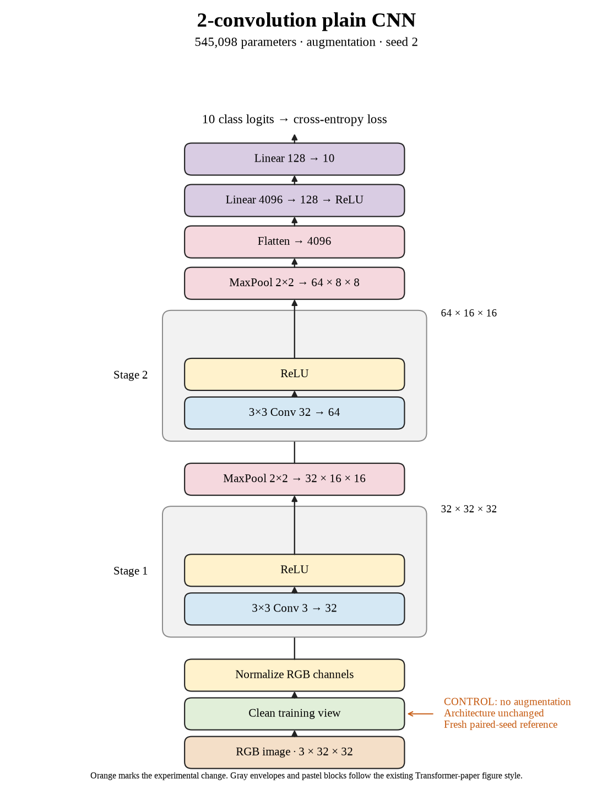

# 06. Does seed variation change our baseline story? (Oct 1, 2026)

**TL;DR:** Seed 2 reached 69.10%, showing why one historical baseline isn't enough to judge small improvements.

**Problem.** I wanted to know how much the same recipe changes across repeats. A treatment can look better just because it gets compared against a weaker control.

*How we know:* the first two controls reached 67.53% and 67.25% test accuracy. Neither number tells me what seed 2 should be expected to beat.

**Experiment.** I ran the unaugmented control with seed 2, keeping batch 512, learning rate 0.01, and 80 epochs fixed.

*What we hope to learn:* if seed 2 differs, matching seeds matters. If all controls agree, a single baseline is less misleading, though still incomplete.

**Outcome.** Test accuracy reached 69.10%, with 76.58% clean training accuracy:

- The 1.85-point difference from seed 1 came from repeats of the same recipe. Like rerunning a race, the finish time changes even when the course doesn't.
- Across three controls, test accuracy averaged 67.96% with a sample standard deviation of 1.00 point, basically the spread of these three scores. That is repeat variation, not a confidence interval.

I used 69.10% for seed 2's comparisons. Flip-only still beat it by 0.94 points.

**Takeaway:** A strong seed needs a strong matching control. Comparing against the same seed keeps ordinary run variation from becoming a fake recipe improvement.

Source: [completed run](https://wandb.ai/7adamyasingh-rutgers-university/cifar-activity/runs/coie4q4g).

<!-- experiment-key: augmentation/none/seed-2 -->

<!-- experiment-architecture -->

Figure exports: [SVG](../../figures/experiments/augmentation-none-seed-2.svg) · [PDF](../../figures/experiments/augmentation-none-seed-2.pdf). Orange marks what changed; the diagram shows the trained architecture.
