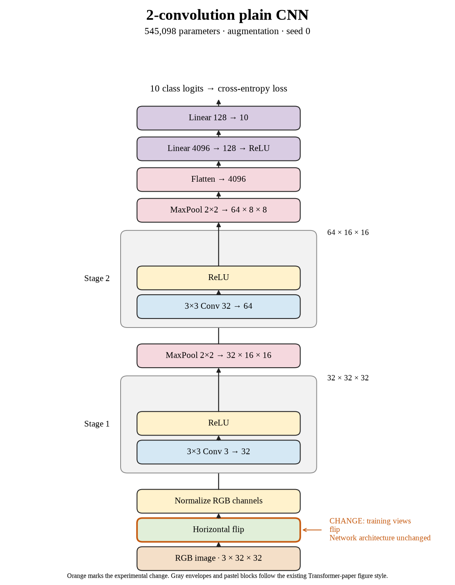

# 07. Does flipping alone help seed 0? (Oct 1, 2026)

**TL;DR:** Flip-only improved seed 0 by 0.13 points, a small gain that needed the other repeats.

**Problem.** Crop + flip lost accuracy, but that combines two changes. I needed to separate them before deciding which part deserved the blame.

*How we know:* seed 0 reached 67.53% without augmentation and 66.25% with crop + flip. Those two results don't tell me what flipping does on its own.

**Experiment.** I flipped training images horizontally with probability 0.5 and removed cropping. The 80-epoch budget and optimizer settings stayed fixed.

*What we hope to learn:* if flipping wins, it is worth separating from cropping. If it loses too, the combined result has more than one possible source.

**Outcome.** Test accuracy reached 67.66%, versus the control's 67.53%:

- A flip changes left and right without cutting out image content, like turning the same photo toward a mirror. That is a gentler change than the crop recipe.
- Training accuracy fell to 70.66%, and the gap fell to 3.00 points. Here the smaller gap came with a test gain, but the gain was only 0.13 points.

I retained the final-epoch result. Epoch 79 had a higher score, but choosing it after looking at the test set would change the experiment.

**Takeaway:** This is a small positive result, not a decisive win by itself. Separating changes makes it possible to learn which one is useful.

Source: [completed run](https://wandb.ai/7adamyasingh-rutgers-university/cifar-activity/runs/dhu1aiwh).

<!-- experiment-key: augmentation/flip/seed-0 -->

<!-- experiment-architecture -->

Figure exports: [SVG](../../figures/experiments/augmentation-flip-seed-0.svg) · [PDF](../../figures/experiments/augmentation-flip-seed-0.pdf). Orange marks what changed; the diagram shows the trained architecture.
