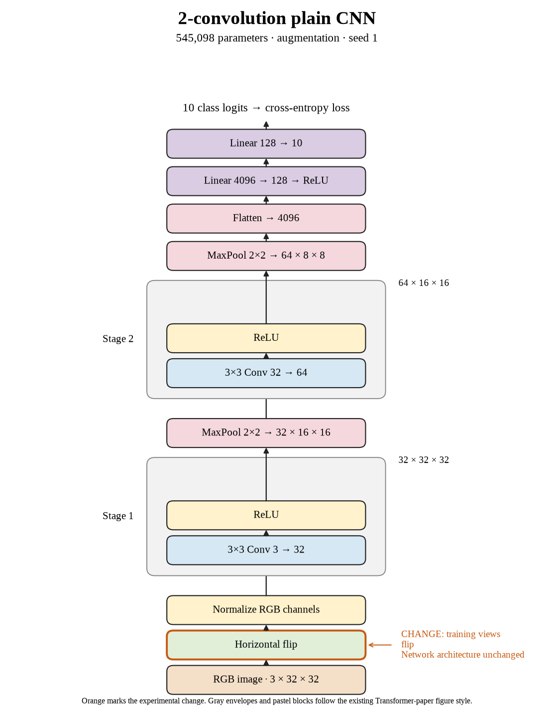

# 08. Does the flip-only gain repeat with seed 1? (Oct 1, 2026)

**TL;DR:** Flip-only gained 1.37 points in seed 1, giving us a second positive paired result.

**Problem.** Seed 0's gain was small. I wanted another repeat to see whether flipping helped consistently or just landed on a slightly better final epoch.

*How we know:* seed 0 gained 0.13 points. The seed-1 control reached 67.25%, while crop + flip reached only 65.45%.

**Experiment.** I used 50% horizontal flips without cropping, with seed 1 and the same batch-512, 80-epoch recipe.

*What we hope to learn:* another gain supports flipping as a useful change. A loss would make the first result less convincing.

**Outcome.** Test accuracy reached 68.62%, a 1.37-point gain against the paired control:

- Flipping preserves the image content while changing its orientation, like recognizing a familiar object in a mirror. The result supports practicing on those views at this budget.
- Clean training accuracy fell from 75.29% to 73.02%, while test accuracy rose. That is the useful trade: less success on familiar examples and more success on new ones.

The gap fell from 8.04 to 4.40 points. Flip-only also beat crop + flip by 3.17 points in this seed.

**Takeaway:** This repeat makes flipping more convincing. I still need the third seed before summarizing the recipe, and the result doesn't establish the exact reason it helped.

Source: [completed run](https://wandb.ai/7adamyasingh-rutgers-university/cifar-activity/runs/fmb65l6j).

<!-- experiment-key: augmentation/flip/seed-1 -->

<!-- experiment-architecture -->

Figure exports: [SVG](../../figures/experiments/augmentation-flip-seed-1.svg) · [PDF](../../figures/experiments/augmentation-flip-seed-1.pdf). Orange marks what changed; the diagram shows the trained architecture.
