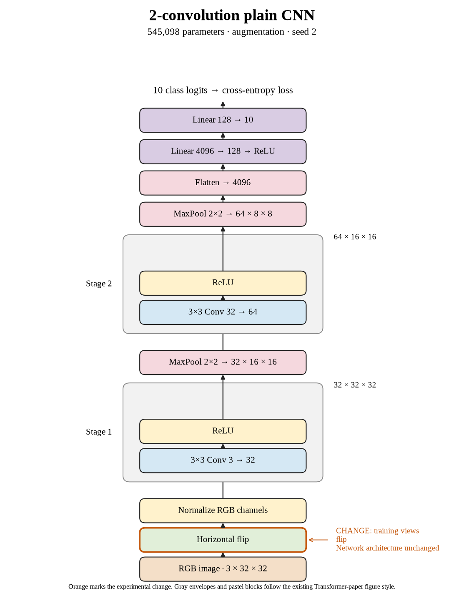

# 09. Does flip-only win across all three seeds? (Oct 1, 2026)

**TL;DR:** Flip-only won in all three paired seeds and averaged a 0.81-point improvement.

**Problem.** The first two repeats favored flipping. I wanted to test it against seed 2's stronger control before calling it our most promising completed recipe.

*How we know:* the seed-2 control reached 69.10% test accuracy. That is already higher than the other controls, so beating a historical 67.67% score wouldn't be enough.

**Experiment.** I repeated flip-only with seed 2, retaining the same architecture, batch size, optimizer, and 80-epoch budget.

*What we hope to learn:* if it beats this control too, the direction is consistent across all three repeats. If it loses, the result depends more on the seed.

**Outcome.** Test accuracy reached 70.04%, a 0.94-point gain against seed 2's control:

- The clean train–test gap fell from 7.48 to 3.29 points while test accuracy improved. Like harder practice that improves the exam score, that is a useful outcome.
- Paired gains were 0.13, 1.37, and 0.94 points. Comparing within each seed is like measuring each runner against their own previous time.

Flip-only averaged 68.77% test accuracy versus 67.96% without augmentation. I kept all three fixed final-epoch results.

**Takeaway:** Flip-only is the best completed recipe so far. Three exploratory repeats support it; they don't establish that it will win with every architecture or training budget.

Source: [completed run](https://wandb.ai/7adamyasingh-rutgers-university/cifar-activity/runs/kumzjtcx).

<!-- experiment-key: augmentation/flip/seed-2 -->

<!-- experiment-architecture -->

Figure exports: [SVG](../../figures/experiments/augmentation-flip-seed-2.svg) · [PDF](../../figures/experiments/augmentation-flip-seed-2.pdf). Orange marks what changed; the diagram shows the trained architecture.
