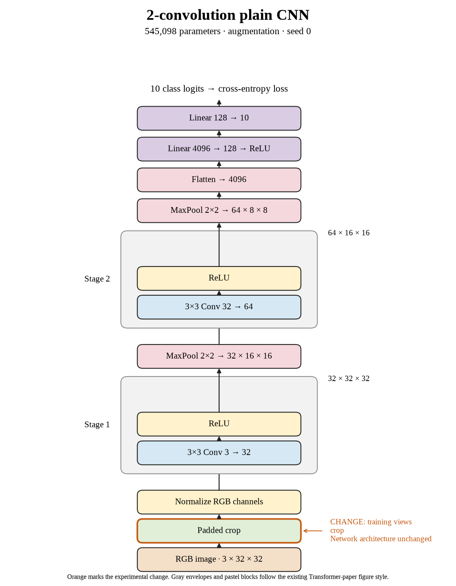

# 10. Does cropping alone explain seed 0's loss? (Oct 1, 2026)

**TL;DR:** Crop-only lost 0.97 points in seed 0, supporting cropping as a source of the combined recipe's loss.

**Problem.** Flipping alone helped, while crop + flip hurt. I needed to run cropping alone to separate the two changes.

*How we know:* seed 0 reached 67.53% without augmentation, 67.66% with flipping, and 66.25% with crop + flip. The missing comparison was crop-only.

**Experiment.** I added four black pixels around each training image and sampled a random 32×32 crop, without flipping. Everything else stayed fixed for 80 epochs.

*What we hope to learn:* if cropping loses too, it helps explain the combined result. If it wins, the combination may behave differently from either change alone.

**Outcome.** Test accuracy reached 66.56%, below the control's 67.53%:

- A padded crop shifts the image and can replace part of its content with a black border, like sliding a photo behind a window. This changes more than orientation.
- Clean training accuracy fell to 67.60%, and the gap shrank to 1.04 points. Both scores fell, so the smaller gap doesn't rescue the result.

Crop-only beat crop + flip by 0.31 points but remained below the unaugmented control. I haven't separated the effects of padding, translation, and clipping.

**Takeaway:** This run points toward the crop recipe as a problem at our fixed budget. It doesn't prove which part of cropping caused it.

Source: [completed run](https://wandb.ai/7adamyasingh-rutgers-university/cifar-activity/runs/uqm1ama5).

<!-- experiment-key: augmentation/crop/seed-0 -->

<!-- experiment-architecture -->

Figure exports: [SVG](../../figures/experiments/augmentation-crop-seed-0.svg) · [PDF](../../figures/experiments/augmentation-crop-seed-0.pdf). Orange marks what changed; the diagram shows the trained architecture.
