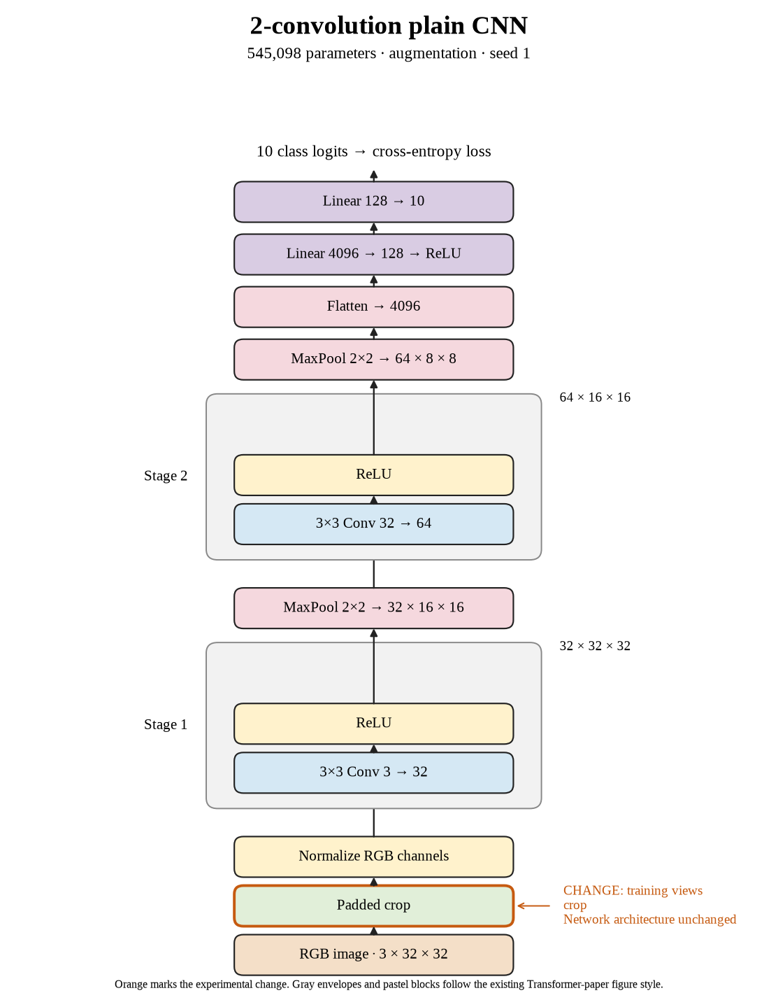

# 11. Does crop-only lose again with seed 1? (Oct 1, 2026)

**TL;DR:** Seed 1 repeated the crop-only loss, again finishing 0.97 points below its control.

**Problem.** Seed 0 suggested that cropping was hurting this recipe. I wanted another paired repeat before treating that result as a pattern.

*How we know:* seed 0 lost 0.97 points with crop-only. For seed 1, the unaugmented control reached 67.25%, and flip-only improved that to 68.62%.

**Experiment.** I repeated four-pixel padded random crops without flipping, using seed 1 and the same 80-epoch budget.

*What we hope to learn:* another loss would strengthen the crop-specific concern. A gain would show that the first result depended more on the seed.

**Outcome.** Test accuracy reached 66.28%, versus 67.25% without augmentation:

- Training accuracy fell to 67.88%, well below the control's 75.29%. The changing views are like a harder practice set; I haven't tested whether more practice would close that difference.
- The gap shrank to 1.60 points, but the test score still fell. Closing a gap by moving the higher score downward isn't the same as improving performance.

Crop-only beat crop + flip by 0.83 points in this seed. It still lost to both the unaugmented control and flip-only.

**Takeaway:** The second repeat supports the same crop concern. More regularization, basically making memorization harder, isn't automatically better for this small model and budget.

Source: [completed run](https://wandb.ai/7adamyasingh-rutgers-university/cifar-activity/runs/et0kud05).

<!-- experiment-key: augmentation/crop/seed-1 -->

<!-- experiment-architecture -->

Figure exports: [SVG](../../figures/experiments/augmentation-crop-seed-1.svg) · [PDF](../../figures/experiments/augmentation-crop-seed-1.pdf). Orange marks what changed; the diagram shows the trained architecture.
