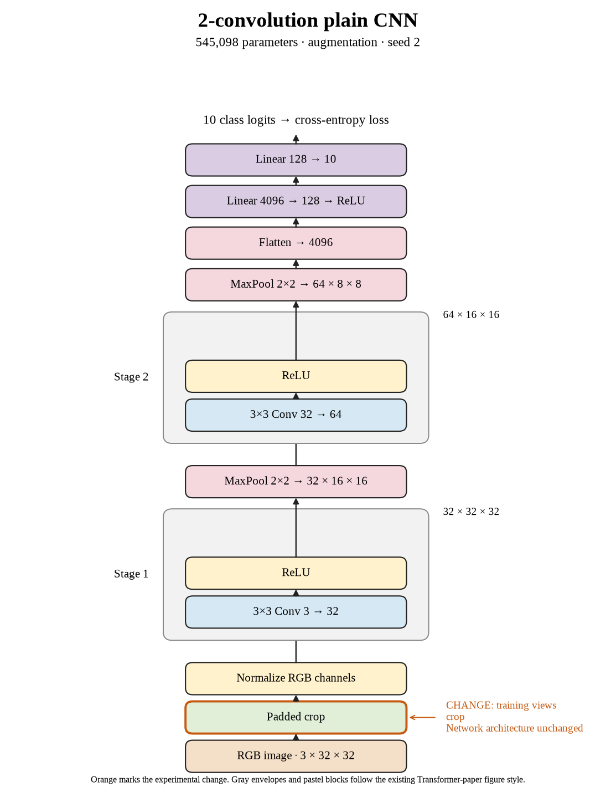

# 12. Is crop-only's loss consistent across the three seeds? (Oct 1, 2026)

**TL;DR:** Crop-only lost in all three paired seeds, averaging 1.24 points below the controls.

**Problem.** The first two crop-only runs lost accuracy. I wanted the last repeat to check whether the direction held against seed 2's stronger control.

*How we know:* seed 2 reached 69.10% without augmentation and 70.04% with flipping. Cropping needed to be judged against those same-seed results.

**Experiment.** I ran seed 2 with four-pixel padded random crops and no flips. The architecture and 80-epoch recipe stayed fixed.

*What we hope to learn:* if cropping loses again, the result is consistent across this suite's repeats. If it wins, I need a more mixed interpretation.

**Outcome.** Test accuracy reached 67.32%, a 1.78-point loss against the control:

- Clean training accuracy reached 68.46%, leaving only a 1.14-point gap. Both scores were lower than the control's, like two runners finishing closer together because the faster one slowed down.
- Crop-only finished 0.13 points below crop + flip in this seed. The ordering between those two recipes changes, even though both lose against the control.

Crop-only averaged 66.72% test accuracy. I retained the three final-epoch results rather than choosing the most favorable seed.

**Takeaway:** The crop loss is consistent against the controls, but adding flipping to cropping doesn't produce a consistent benefit. The effects of separate changes don't simply add up.

Source: [completed run](https://wandb.ai/7adamyasingh-rutgers-university/cifar-activity/runs/7a8torsx).

<!-- experiment-key: augmentation/crop/seed-2 -->

<!-- experiment-architecture -->

Figure exports: [SVG](../../figures/experiments/augmentation-crop-seed-2.svg) · [PDF](../../figures/experiments/augmentation-crop-seed-2.pdf). Orange marks what changed; the diagram shows the trained architecture.
