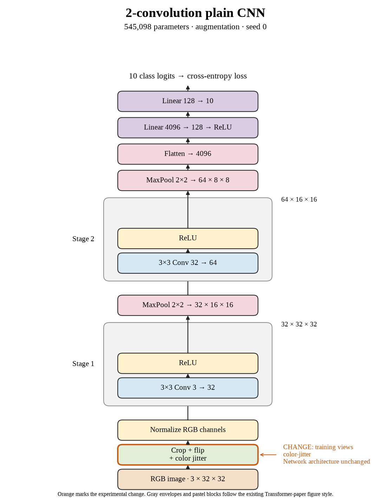

# 13. Does color jitter improve crop + flip in seed 0? (Oct 1, 2026)

**TL;DR:** Color jitter added only 0.14 points over crop + flip while taking about 74 times as long in this implementation.

**Problem.** I wanted to see whether changing image colors would improve the existing crop + flip recipe. A small accuracy change also needs to be weighed against its runtime.

*How we know:* seed 0's crop + flip run reached 66.25% in 38.94 seconds of training and evaluation. The unaugmented control reached 67.53%.

**Experiment.** I added random brightness, contrast, and saturation changes of ±0.2, plus hue changes of ±0.05. Basically, I changed the colors while keeping the class label and crop + flip pipeline.

*What we hope to learn:* a clear gain would support varying colors. Little gain with high cost would make this implementation hard to justify.

**Outcome.** Test accuracy reached 66.39%, and training plus evaluation took 2,877.25 seconds:

- Color changes provide different appearances of the same image, like practicing under different lighting. This run doesn't establish that those changes caused a reliable improvement.
- The per-image CPU transform pipeline was expensive: about 48 minutes versus 39 seconds. That is a cost of this implementation, not proof that color augmentation must always be slow.

The result remained 1.14 points below the paired unaugmented control. I retained the fixed result and kept the other seeds in the queue.

**Takeaway:** The measured gain over crop + flip is tiny relative to the runtime increase. Accuracy and implementation cost are separate questions, and both need measuring.

Source: [completed run](https://wandb.ai/7adamyasingh-rutgers-university/cifar-activity/runs/hexupuz4).

<!-- experiment-key: augmentation/color-jitter/seed-0 -->

<!-- experiment-architecture -->

Figure exports: [SVG](../../figures/experiments/augmentation-color-jitter-seed-0.svg) · [PDF](../../figures/experiments/augmentation-color-jitter-seed-0.pdf). Orange marks what changed; the diagram shows the trained architecture.
