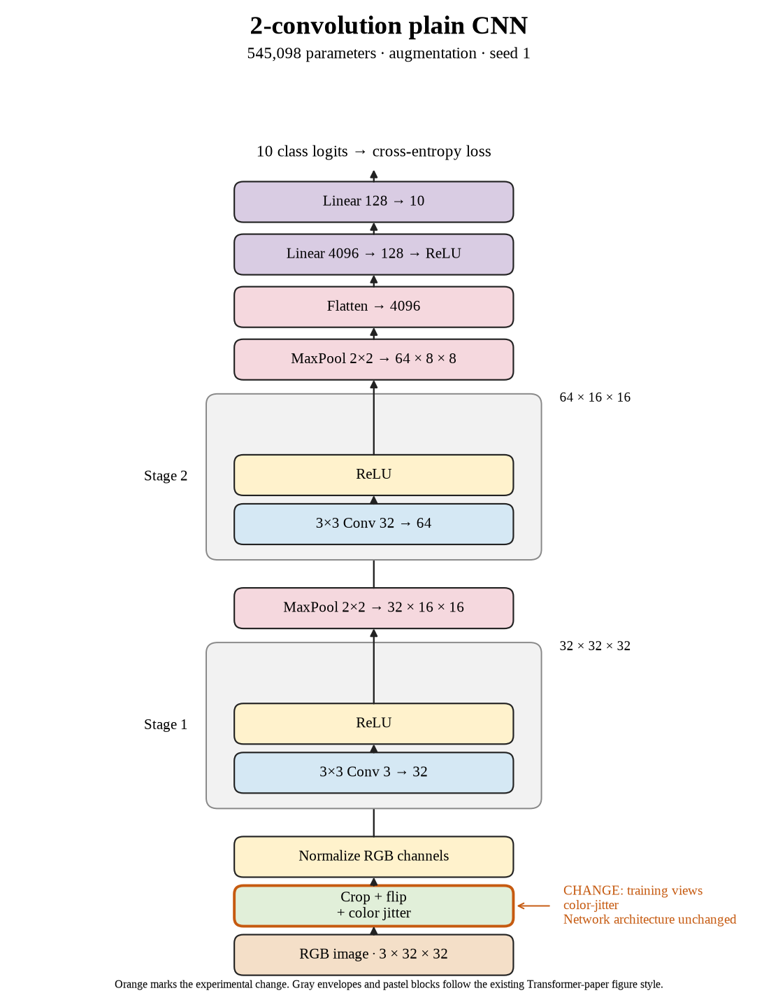

# 14. Does color jitter's small gain repeat with seed 1? (Oct 1, 2026)

**TL;DR:** Color jitter lost 0.04 points against crop + flip in seed 1, so the first two repeats show almost no average gain.

**Problem.** Seed 0's color-jitter gain was only 0.14 points. I wanted a repeat before treating that small change as useful, especially given the runtime cost.

*How we know:* seed 1's crop + flip run reached 65.45% test accuracy. Its unaugmented control reached 67.25%.

**Experiment.** I repeated the same brightness, contrast, saturation, and hue changes on top of crop + flip with seed 1. The model and 80-epoch budget stayed fixed.

*What we hope to learn:* another gain would support the addition. A flat or worse result would mean the first small gain didn't repeat.

**Outcome.** Test accuracy reached 65.41%, and training plus evaluation took 3,113.61 seconds:

- The added color changes didn't improve this repeat, like changing the lighting on a practice sheet without improving the exam score. The first two paired changes are +0.14 and −0.04 points.
- Runtime was about 52 minutes versus 39 seconds for crop + flip, roughly 80 times longer. That expensive implementation needs to be judged separately from the augmentation idea.

The two-seed mean gain over crop + flip is just 0.05 points. Seed 2 is still running, so I haven't written a final three-seed conclusion.

**Takeaway:** Color jitter hasn't earned its current cost in the completed runs. I need the third result before closing the recipe, and a faster implementation would be a separate experiment.

Source: [completed run](https://wandb.ai/7adamyasingh-rutgers-university/cifar-activity/runs/36ilhl68).

<!-- experiment-key: augmentation/color-jitter/seed-1 -->

<!-- experiment-architecture -->

Figure exports: [SVG](../../figures/experiments/augmentation-color-jitter-seed-1.svg) · [PDF](../../figures/experiments/augmentation-color-jitter-seed-1.pdf). Orange marks what changed; the diagram shows the trained architecture.
