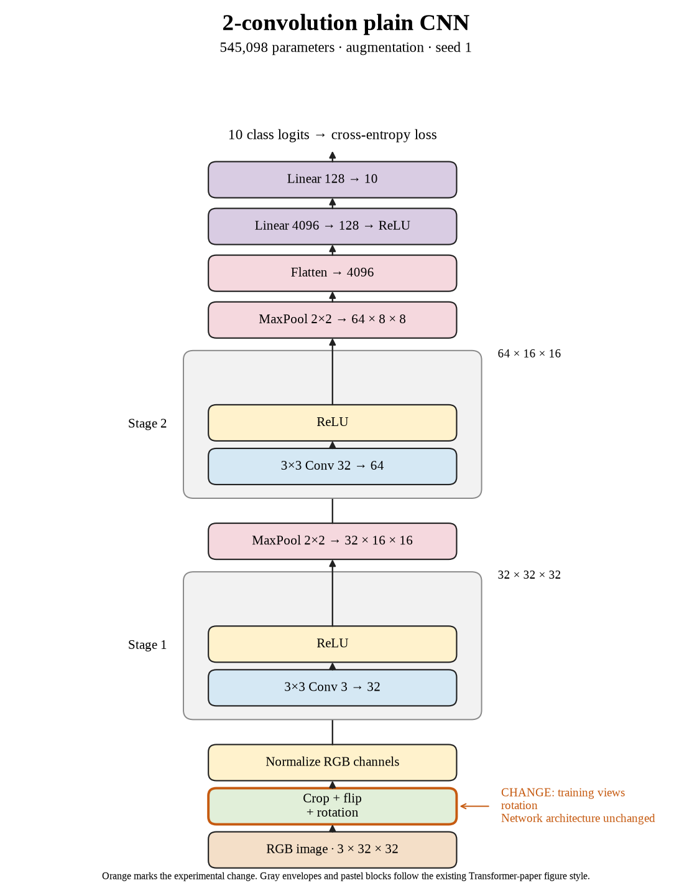

# 17. Do small rotations improve seed 1? (Oct 1, 2026)

**TL;DR:** Small rotations reached 60.04% test accuracy, -5.41 percentage points versus crop + flip for the same seed.

**Problem.** I wanted to see whether small rotations would help this small CNN recognize new images. The useful comparison is the matching seed's crop + flip recipe, rather than a different architecture or training budget.

*How we know:* That reference reached 65.45% test accuracy and 66.41% clean training accuracy. I did not know whether the changed views would improve recognition or just make fitting harder.

**Experiment.** I added random rotations between −15° and +15° to crop + flip, using bilinear interpolation and black fill. Batch 512, SGD learning rate 0.01, 80 epochs, and the architecture stayed fixed.

*What we hope to learn:* If clean test accuracy rises, this recipe is useful under these conditions. If training accuracy falls without a test gain, making the task harder did not pay off at this budget.

**Outcome.** The model reached 60.94% clean training accuracy and 60.04% test accuracy:

- Rotation changes orientation and introduces interpolation and empty corners, like tilting a photograph. The measured effect belongs to that entire transform.
- The clean train–test gap is 0.90 points. A smaller gap alone is not success, like two lower exam scores becoming closer without either improving.

I recorded the -5.41-point paired change and 1167.93 seconds of training/evaluation (30.03× the reference). The test comparisons are exploratory; I did not select checkpoints with them.

**Takeaway:** I carry the measured accuracy and implementation cost forward separately. This seed gives one result; the three-seed comparison is the evidence for whether the recipe repeats.

Source: [completed run](https://wandb.ai/7adamyasingh-rutgers-university/cifar-activity/runs/0aq2q6y9) · [saved metrics](../../runs/augmentation/rotation/seed-1/summary.json).

<!-- experiment-key: augmentation/rotation/seed-1 -->

<!-- experiment-architecture -->

Figure exports: [SVG](../../figures/experiments/augmentation-rotation-seed-1.svg) · [PDF](../../figures/experiments/augmentation-rotation-seed-1.pdf). Orange marks what changed; the diagram shows the trained architecture.
