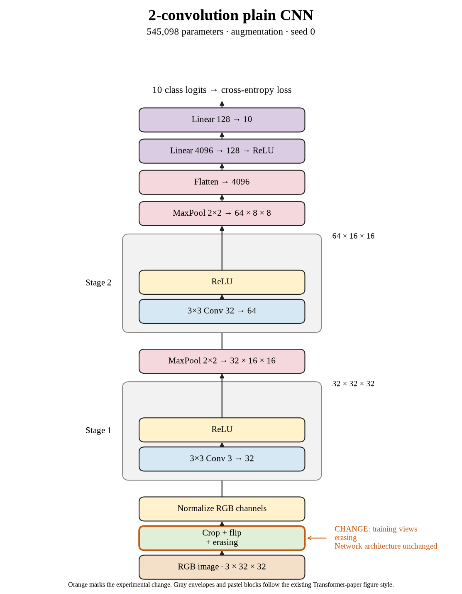

# 19. Do random erasing improve seed 0? (Oct 1, 2026)

**TL;DR:** Random erasing reached 65.93% test accuracy, -0.32 percentage points versus crop + flip for the same seed.

**Problem.** I wanted to see whether random erasing would help this small CNN recognize new images. The useful comparison is the matching seed's crop + flip recipe, rather than a different architecture or training budget.

*How we know:* That reference reached 66.25% test accuracy and 66.75% clean training accuracy. I did not know whether the changed views would improve recognition or just make fitting harder.

**Experiment.** After crop + flip and normalization, I erased a random region with probability 0.2. Its area was 2–20% of the image. Batch 512, SGD learning rate 0.01, 80 epochs, and the architecture stayed fixed.

*What we hope to learn:* If clean test accuracy rises, this recipe is useful under these conditions. If training accuracy falls without a test gain, making the task harder did not pay off at this budget.

**Outcome.** The model reached 66.51% clean training accuracy and 65.93% test accuracy:

- Erasing hides part of the object, like putting a sticky note over a photo. It makes the training task harder without changing the clean evaluation images.
- The clean train–test gap is 0.58 points. A smaller gap alone is not success, like two lower exam scores becoming closer without either improving.

I recorded the -0.32-point paired change and 366.50 seconds of training/evaluation (9.41× the reference). The test comparisons are exploratory; I did not select checkpoints with them.

**Takeaway:** I carry the measured accuracy and implementation cost forward separately. This seed gives one result; the three-seed comparison is the evidence for whether the recipe repeats.

Source: [completed run](https://wandb.ai/7adamyasingh-rutgers-university/cifar-activity/runs/bk5zo1re) · [saved metrics](../../runs/augmentation/erasing/seed-0/summary.json).

<!-- experiment-key: augmentation/erasing/seed-0 -->

<!-- experiment-architecture -->

Figure exports: [SVG](../../figures/experiments/augmentation-erasing-seed-0.svg) · [PDF](../../figures/experiments/augmentation-erasing-seed-0.pdf). Orange marks what changed; the diagram shows the trained architecture.
