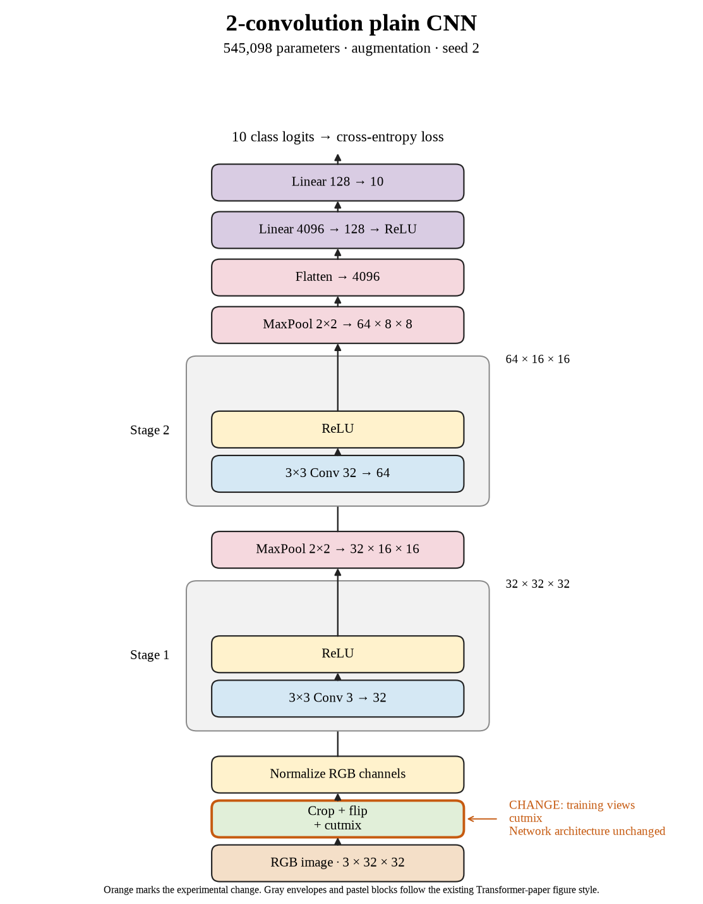

# 27. Do CutMix improve seed 2? (Oct 1, 2026)

**TL;DR:** Cutmix reached 58.08% test accuracy, -9.37 percentage points versus crop + flip for the same seed.

**Problem.** I wanted to see whether CutMix would help this small CNN recognize new images. The useful comparison is the matching seed's crop + flip recipe, rather than a different architecture or training budget.

*How we know:* That reference reached 67.45% test accuracy and 68.21% clean training accuracy. I did not know whether the changed views would improve recognition or just make fitting harder.

**Experiment.** I added CutMix with alpha 1.0 after crop + flip. I replaced a rectangle with pixels from another image and mixed labels by the actual pasted area. Batch 512, SGD learning rate 0.01, 80 epochs, and the architecture stayed fixed.

*What we hope to learn:* If clean test accuracy rises, this recipe is useful under these conditions. If training accuracy falls without a test gain, making the task harder did not pay off at this budget.

**Outcome.** The model reached 58.37% clean training accuracy and 58.08% test accuracy:

- CutMix combines patches and labels, like making a photo collage. Clean evaluation still asks for one class, so its accuracy is separate from the mixed-target training metric.
- The clean train–test gap is 0.29 points. A smaller gap alone is not success, like two lower exam scores becoming closer without either improving.

I recorded the -9.37-point paired change and 47.95 seconds of training/evaluation (1.25× the reference). The test comparisons are exploratory; I did not select checkpoints with them.

**Takeaway:** I carry the measured accuracy and implementation cost forward separately. This seed gives one result; the three-seed comparison is the evidence for whether the recipe repeats.

Source: [completed run](https://wandb.ai/7adamyasingh-rutgers-university/cifar-activity/runs/pduj7n4j) · [saved metrics](../../runs/augmentation/cutmix/seed-2/summary.json).

<!-- experiment-key: augmentation/cutmix/seed-2 -->

<!-- experiment-architecture -->

Figure exports: [SVG](../../figures/experiments/augmentation-cutmix-seed-2.svg) · [PDF](../../figures/experiments/augmentation-cutmix-seed-2.pdf). Orange marks what changed; the diagram shows the trained architecture.
