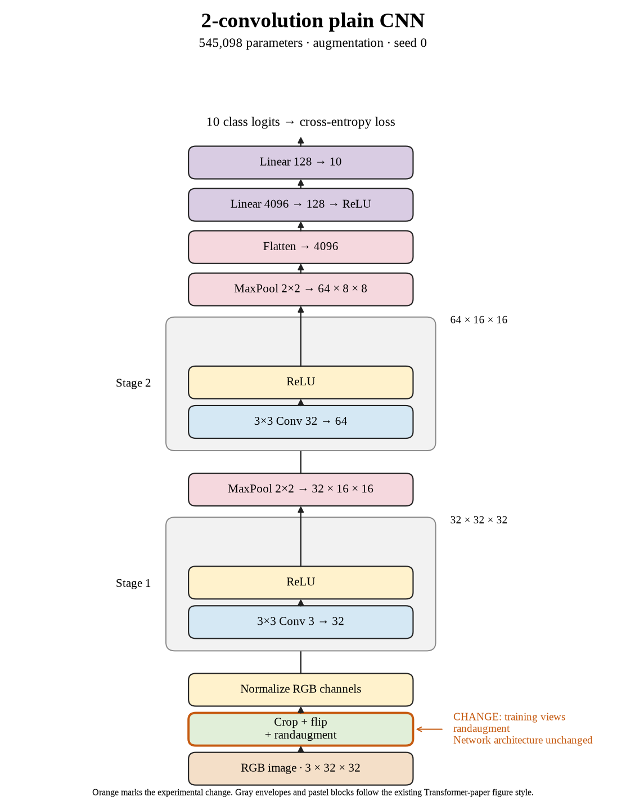

# 28. Do RandAugment improve seed 0? (Oct 1, 2026)

**TL;DR:** Randaugment reached 64.49% test accuracy, -1.76 percentage points versus crop + flip for the same seed.

**Problem.** I wanted to see whether RandAugment would help this small CNN recognize new images. The useful comparison is the matching seed's crop + flip recipe, rather than a different architecture or training budget.

*How we know:* That reference reached 66.25% test accuracy and 66.75% clean training accuracy. I did not know whether the changed views would improve recognition or just make fitting harder.

**Experiment.** I added two randomly selected augmentation operations at magnitude 9, with 31 magnitude bins, on top of crop + flip. Batch 512, SGD learning rate 0.01, 80 epochs, and the architecture stayed fixed.

*What we hope to learn:* If clean test accuracy rises, this recipe is useful under these conditions. If training accuracy falls without a test gain, making the task harder did not pay off at this budget.

**Outcome.** The model reached 65.02% clean training accuracy and 64.49% test accuracy:

- The sampled operations change several properties, like drawing different practice conditions from a hat. This result measures the policy as a whole, not any one operation.
- The clean train–test gap is 0.53 points. A smaller gap alone is not success, like two lower exam scores becoming closer without either improving.

I recorded the -1.76-point paired change and 1705.98 seconds of training/evaluation (43.82× the reference). The test comparisons are exploratory; I did not select checkpoints with them.

**Takeaway:** I carry the measured accuracy and implementation cost forward separately. This seed gives one result; the three-seed comparison is the evidence for whether the recipe repeats.

Source: [completed run](https://wandb.ai/7adamyasingh-rutgers-university/cifar-activity/runs/7pprevtf) · [saved metrics](../../runs/augmentation/randaugment/seed-0/summary.json).

<!-- experiment-key: augmentation/randaugment/seed-0 -->

<!-- experiment-architecture -->

Figure exports: [SVG](../../figures/experiments/augmentation-randaugment-seed-0.svg) · [PDF](../../figures/experiments/augmentation-randaugment-seed-0.pdf). Orange marks what changed; the diagram shows the trained architecture.
