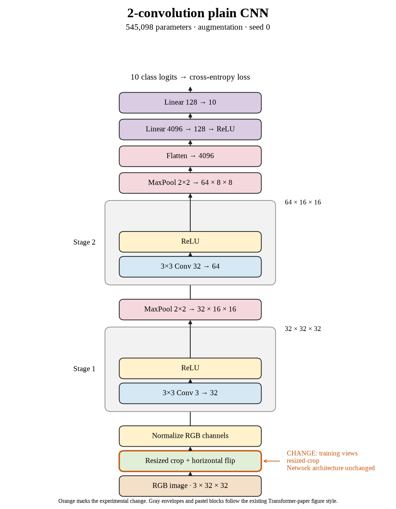

# 31. Do resized crops improve seed 0? (Oct 1, 2026)

**TL;DR:** Resized crops reached 66.70% test accuracy, +0.45 percentage points versus crop + flip for the same seed.

**Problem.** I wanted to see whether resized crops would help this small CNN recognize new images. The useful comparison is the matching seed's crop + flip recipe, rather than a different architecture or training budget.

*How we know:* That reference reached 66.25% test accuracy and 66.75% clean training accuracy. I did not know whether the changed views would improve recognition or just make fitting harder.

**Experiment.** I replaced the padded crop with a crop of 80–100% of the original area, aspect ratio 0.9–1.1, resized to 32×32. Horizontal flipping remained. Batch 512, SGD learning rate 0.01, 80 epochs, and the architecture stayed fixed.

*What we hope to learn:* If clean test accuracy rises, this recipe is useful under these conditions. If training accuracy falls without a test gain, making the task harder did not pay off at this budget.

**Outcome.** The model reached 68.95% clean training accuracy and 66.70% test accuracy:

- Resizing a crop changes scale and interpolation, like zooming into a photo. It differs from padded cropping in several linked ways, so I cannot attribute the result to scale alone.
- The clean train–test gap is 2.25 points. A smaller gap alone is not success, like two lower exam scores becoming closer without either improving.

I recorded the +0.45-point paired change and 681.70 seconds of training/evaluation (17.51× the reference). The test comparisons are exploratory; I did not select checkpoints with them.

**Takeaway:** I carry the measured accuracy and implementation cost forward separately. This seed gives one result; the three-seed comparison is the evidence for whether the recipe repeats.

Source: [completed run](https://wandb.ai/7adamyasingh-rutgers-university/cifar-activity/runs/28g4hzzu) · [saved metrics](../../runs/augmentation/resized-crop/seed-0/summary.json).

<!-- experiment-key: augmentation/resized-crop/seed-0 -->

<!-- experiment-architecture -->

Figure exports: [SVG](../../figures/experiments/augmentation-resized-crop-seed-0.svg) · [PDF](../../figures/experiments/augmentation-resized-crop-seed-0.pdf). Orange marks what changed; the diagram shows the trained architecture.
