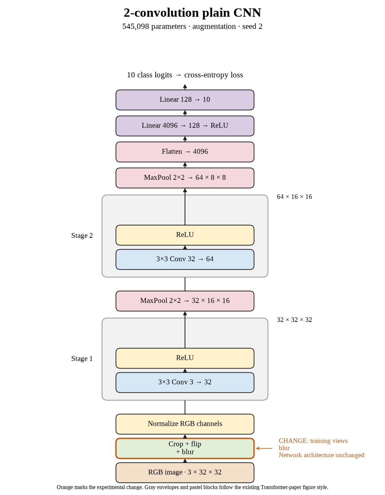

# 42. Do occasional blur improve seed 2? (Oct 1, 2026)

**TL;DR:** Occasional blur reached 66.37% test accuracy, -1.08 percentage points versus crop + flip for the same seed.

**Problem.** I wanted to see whether occasional blur would help this small CNN recognize new images. The useful comparison is the matching seed's crop + flip recipe, rather than a different architecture or training budget.

*How we know:* That reference reached 67.45% test accuracy and 68.21% clean training accuracy. I did not know whether the changed views would improve recognition or just make fitting harder.

**Experiment.** I added a 3×3 Gaussian blur with probability 0.2 and sigma between 0.1 and 1.0 to crop + flip. Batch 512, SGD learning rate 0.01, 80 epochs, and the architecture stayed fixed.

*What we hope to learn:* If clean test accuracy rises, this recipe is useful under these conditions. If training accuracy falls without a test gain, making the task harder did not pay off at this budget.

**Outcome.** The model reached 67.26% clean training accuracy and 66.37% test accuracy:

- Blur softens fine detail, like looking through a slightly unfocused lens. That changes the evidence available during training, while evaluation images remain clean.
- The clean train–test gap is 0.89 points. A smaller gap alone is not success, like two lower exam scores becoming closer without either improving.

I recorded the -1.08-point paired change and 337.76 seconds of training/evaluation (8.78× the reference). The test comparisons are exploratory; I did not select checkpoints with them.

**Takeaway:** I carry the measured accuracy and implementation cost forward separately. This seed gives one result; the three-seed comparison is the evidence for whether the recipe repeats.

Source: [completed run](https://wandb.ai/7adamyasingh-rutgers-university/cifar-activity/runs/vcfmo5tp) · [saved metrics](../../runs/augmentation/blur/seed-2/summary.json).

<!-- experiment-key: augmentation/blur/seed-2 -->

<!-- experiment-architecture -->

Figure exports: [SVG](../../figures/experiments/augmentation-blur-seed-2.svg) · [PDF](../../figures/experiments/augmentation-blur-seed-2.pdf). Orange marks what changed; the diagram shows the trained architecture.
