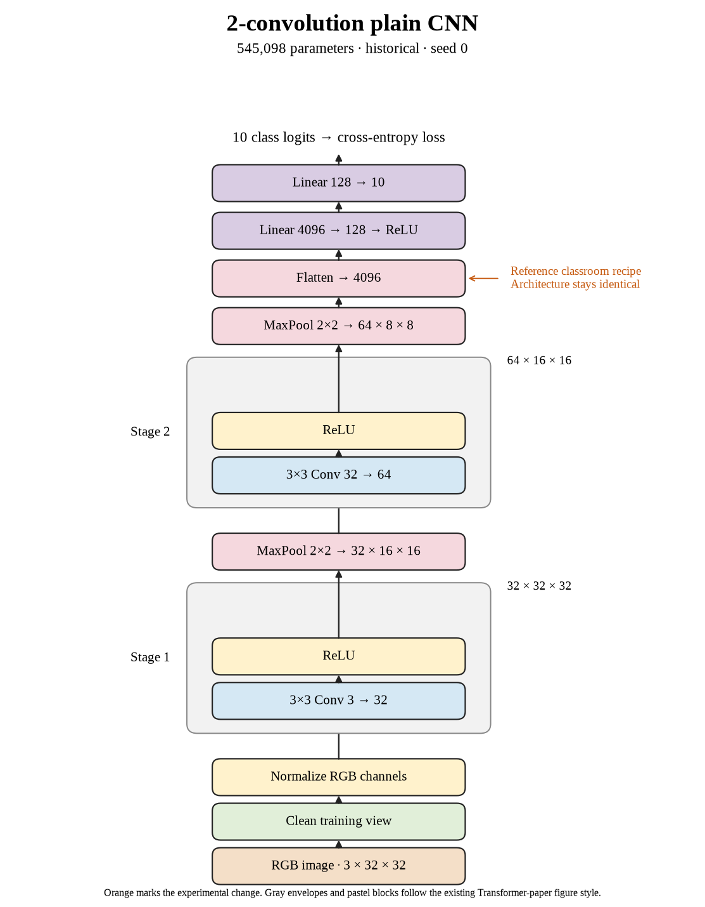

# 46. What does the classroom CNN learn in ten epochs? (Sep 30, 2026)

**TL;DR:** The model reached 63.68% test accuracy after 10 epochs and 7,820 optimizer updates.

**Problem.** I wanted to understand how speed and learning interact in the original two-convolution activity. Processing images faster does not automatically mean the model gets enough useful weight updates.

*How we know:* CIFAR-10 has ten classes, so uniform random guessing would average about 10% accuracy. I needed a measured classroom-model reference before tuning execution.

**Experiment.** I trained the original CNN with batch 64, learning rate 0.01, seed 0, and 10 epochs, without augmentation. Architecture and normalization remained unchanged.

*What we hope to learn:* If accuracy holds while runtime falls, the execution change is useful at this budget. If accuracy drops, I need to compare optimization work instead of only epochs or images per second.

**Outcome.** Clean training accuracy was 67.76% and final test accuracy was 63.68%:

- The run made 7,820 updates. A batch is one chance to adjust the weights, like checking an answer after a group of practice questions rather than after every question.
- Training and evaluation took 22.39 seconds. That measures execution cost, like timing the practice session; it does not tell me how much was learned.

I retained this seed-0 run as the template reference for the throughput study.

**Takeaway:** Epochs count passes through data; optimizer updates count weight changes. I need both, plus held-out accuracy, to interpret a speed experiment.

Source: [completed run](https://wandb.ai/7adamyasingh-rutgers-university/cifar-activity/runs/812pre34) · [saved metrics](../../runs/baseline/last.pt).

<!-- experiment-key: historical/baseline -->

<!-- experiment-architecture -->

Figure exports: [SVG](../../figures/experiments/historical-baseline.svg) · [PDF](../../figures/experiments/historical-baseline.pdf). Orange marks what changed; the diagram shows the trained architecture.
