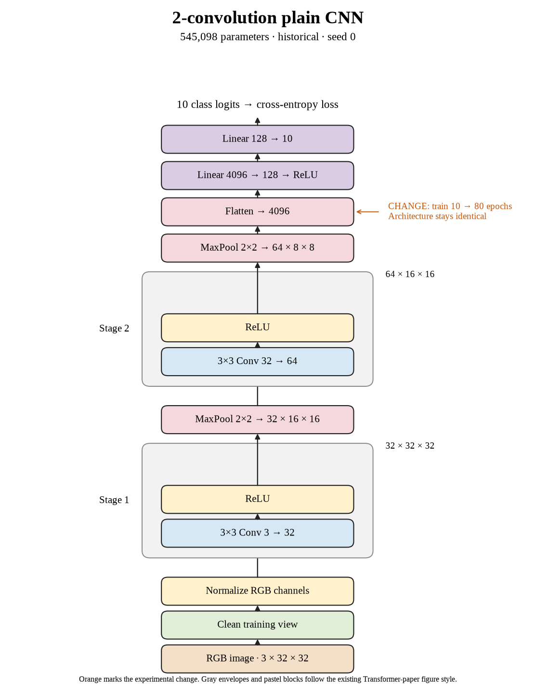

# 48. Can longer training recover the large-batch accuracy loss? (Sep 30, 2026)

**TL;DR:** The model reached 67.67% test accuracy after 80 epochs and 7,840 optimizer updates.

**Problem.** I wanted to understand how speed and learning interact in the original two-convolution activity. Processing images faster does not automatically mean the model gets enough useful weight updates.

*How we know:* The reference reached 48.58% test accuracy at batch 512 and 10 epochs.

**Experiment.** I trained the original CNN with batch 512, learning rate 0.01, seed 0, and 80 epochs, without augmentation. Architecture and normalization remained unchanged.

*What we hope to learn:* If accuracy holds while runtime falls, the execution change is useful at this budget. If accuracy drops, I need to compare optimization work instead of only epochs or images per second.

**Outcome.** Clean training accuracy was 74.18% and final test accuracy was 67.67%:

- The run made 7,840 updates. A batch is one chance to adjust the weights, like checking an answer after a group of practice questions rather than after every question.
- Training and evaluation took 36.85 seconds. That measures execution cost, like timing the practice session; it does not tell me how much was learned.

I recorded the +19.09-point change against the reference and kept accuracy separate from speed.

**Takeaway:** Epochs count passes through data; optimizer updates count weight changes. I need both, plus held-out accuracy, to interpret a speed experiment.

Source: [completed run](https://wandb.ai/7adamyasingh-rutgers-university/cifar-activity/runs/5j92g6cx) · [saved metrics](../../runs/step-matched-b512/last.pt).

<!-- experiment-key: historical/step-matched-b512 -->

<!-- experiment-architecture -->

Figure exports: [SVG](../../figures/experiments/historical-step-matched-b512.svg) · [PDF](../../figures/experiments/historical-step-matched-b512.pdf). Orange marks what changed; the diagram shows the trained architecture.
