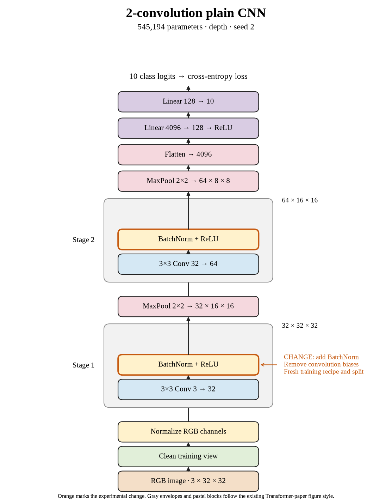

# 51. What does the improved two-convolution baseline learn in seed 2? (Oct 1, 2026)

**TL;DR:** The new baseline reached 78.61% validation score and 100.00% final training accuracy, leaving a clear generalization gap.

**Problem.** I wanted a stronger training baseline before testing extra depth. The old batch-512, constant-learning-rate recipe was limited, but its test scores are not directly comparable to this validation split.

*How we know:* The historical 80-epoch recipe reached 67.67% test accuracy. This experiment changes optimization, normalization, training duration, and the data split together, so it cannot isolate any one of those changes.

**Experiment.** I added batch normalization and removed convolution biases. I used 45,000 training and 5,000 validation images, batch 128, momentum 0.9, weight decay 0.0005, and 160 epochs with warmup and cosine learning-rate decay.

*What we hope to learn:* If training accuracy improves, the baseline can fit the data better. If validation lags behind, I need to investigate generalization as I change the architecture.

**Outcome.** The mean validation accuracy over the last ten epochs was 78.61%, with 100.00% final clean training accuracy:

- The learning-rate schedule makes larger adjustments early and finer ones late, like rough sanding followed by polishing. This combined experiment does not isolate the schedule's contribution.
- Final validation accuracy was 78.64%. The remaining gap is like mastering the practice sheet while still missing new questions; fitting training images is not the whole task.

I use this run as the validation reference for the next depth with the same seed. The test set remains reserved for the eventual selected model.

**Takeaway:** The improved recipe gives me a baseline that can fit its training examples. Architecture experiments now need to earn their improvement on held-out validation images.

Source: [completed run](https://wandb.ai/7adamyasingh-rutgers-university/cifar-activity/runs/1zlcdfp3) · [saved metrics](../../runs/depth/plain/conv-2/seed-2/summary.json).

<!-- experiment-key: depth/plain/conv-2/seed-2 -->

<!-- experiment-architecture -->

Figure exports: [SVG](../../figures/experiments/depth-plain-conv-2-seed-2.svg) · [PDF](../../figures/experiments/depth-plain-conv-2-seed-2.pdf). Orange marks what changed; the diagram shows the trained architecture.
