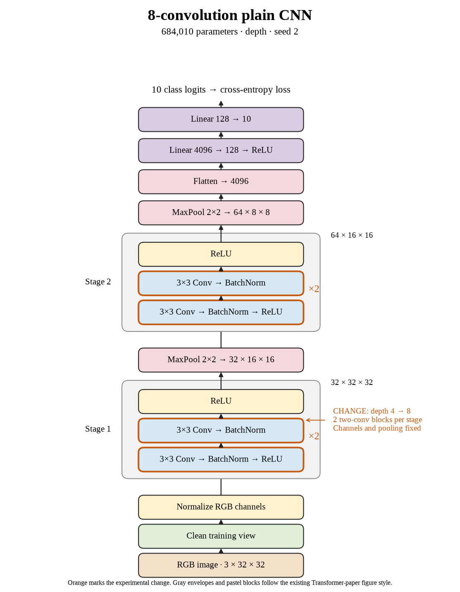

# 57. Do 8 convolutions help seed 2? (Oct 1, 2026)

**TL;DR:** Increasing depth from 4 to 8 convolutions changed validation score by +2.74 points, reaching 87.39%.

**Problem.** I wanted to test whether increasing depth from 4 to 8 convolutions improves the features learned from these small images. A larger or easier-to-optimize model still has to help on held-out examples.

*How we know:* The matched reference reached 84.65% validation score in seed 2. I kept the same split and training recipe so the architecture change is the comparison.

**Experiment.** I used 4 convolutions in each of the 32- and 64-channel stages. Pooling locations and the 4096 → 128 → 10 classifier stayed fixed. Every run finishes 160 epochs before the queue makes a depth decision.

*What we hope to learn:* If validation improves, the extension helps under this recipe. If only training improves, extra fitting is not enough. Worse training would point me toward an optimization problem to investigate.

**Outcome.** Validation score reached 87.39% and final clean training accuracy reached 100.00%:

- Extra convolutions add processing before pooling shrinks the image, like combining small visual clues before summarizing them. This tests more depth at fixed channel widths.
- Final validation accuracy was 87.32% and validation loss was 0.4646. Training can improve independently, like getting better at familiar exercises without matching progress on new ones.

I retain the +2.74-point paired change. The queue waits for all three seeds before judging a plateau or decline; this entry covers one completed seed.

**Takeaway:** I judge the architecture by matched validation results, not parameter count or training accuracy alone. The shared recipe makes the direction of the comparison interpretable.

Source: [completed run](https://wandb.ai/7adamyasingh-rutgers-university/cifar-activity/runs/edm5eyft) · [saved metrics](../../runs/depth/plain/conv-8/seed-2/summary.json).

<!-- experiment-key: depth/plain/conv-8/seed-2 -->

<!-- experiment-architecture -->

Figure exports: [SVG](../../figures/experiments/depth-plain-conv-8-seed-2.svg) · [PDF](../../figures/experiments/depth-plain-conv-8-seed-2.pdf). Orange marks what changed; the diagram shows the trained architecture.
