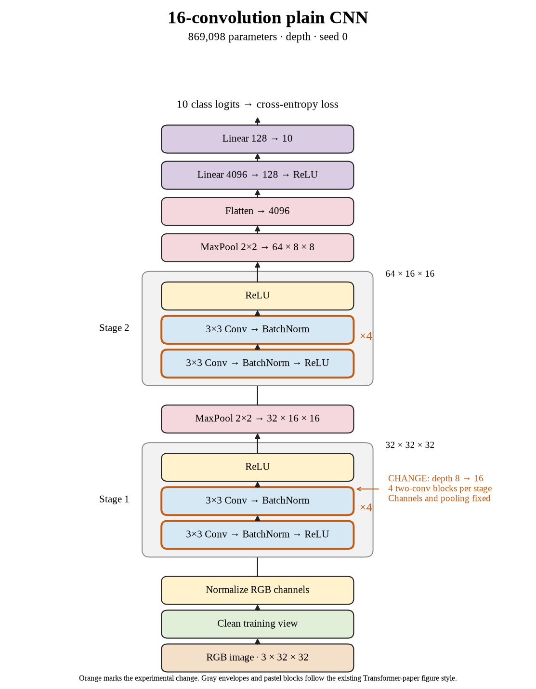

# 58. Does doubling plain depth to sixteen help seed 0? (Oct 1, 2026)

<!-- experiment-key: depth/plain/conv-16/seed-0 -->

**TL;DR:** I gained 0.34 validation percentage points by doubling depth, but training and evaluation took almost twice as long.

**Problem.** I want to find where adding convolutional layers stops helping. The eight-layer model already fits training perfectly. More depth needs to help on unseen images.

*How we know:* the matched seed-0 control scored 86.79% on validation and reached 100% clean training accuracy. I needed to test whether extra layers helped.

**Experiment.** I increased plain depth from eight to sixteen convolutions, with four two-convolution blocks in each stage. I kept widths, pooling, the classifier, batch normalization (which normalizes activations), and the training recipe fixed. Both runs used seed 0, 160 epochs, and the same 45,000/5,000 training/validation split without augmentation.

*What we hope to learn:* if validation improves substantially, depth still helps. If the gain shrinks while computation grows, I am approaching diminishing returns.

**Outcome.** The last-ten-epoch validation score reached 87.13%; final-epoch validation accuracy was 87.08%:

- Both models reached 100% training accuracy, like two students acing the practice sheet. That does not establish that the deeper student handles new questions much better.
- Final validation loss increased from 0.469 to 0.495 despite the accuracy gain. Loss also grades confidence, like penalizing an emphatic wrong answer more than a tentative one; accuracy alone misses that distinction.

Training plus evaluation took 16.7 minutes versus 8.5. The three-seed depth gain was +0.271 points, the first increase below our +0.3 threshold. The queue therefore advances to thirty-two layers; one small gain does not trigger stopping.

**Takeaway:** I got a modest gain at a substantial runtime cost. Final metrics alone do not explain why; the test set stays held out.

Source: [completed run](https://wandb.ai/7adamyasingh-rutgers-university/cifar-activity/runs/ftreifzc), `runs/depth/plain/conv-16/seed-0/summary.json`; control: `runs/depth/plain/conv-8/seed-0/summary.json`.

<!-- experiment-architecture -->

Figure exports: [SVG](../../figures/experiments/depth-plain-conv-16-seed-0.svg) · [PDF](../../figures/experiments/depth-plain-conv-16-seed-0.pdf). Orange marks what changed; the diagram shows the trained architecture.
