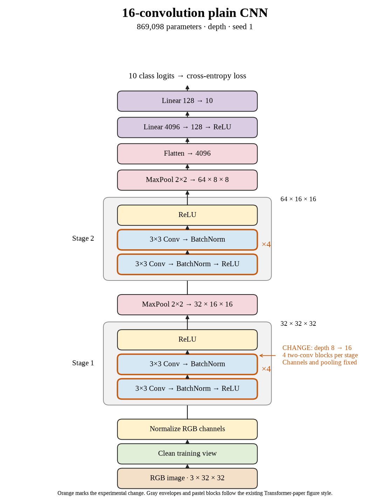

# 59. Does seed 1 support adding sixteen plain convolutions? (Oct 1, 2026)

<!-- experiment-key: depth/plain/conv-16/seed-1 -->

**TL;DR:** Seed 1 improved by 0.40 validation percentage points, but that single-seed gain does not override the smaller three-seed average.

**Problem.** I need to know whether deeper models improve across random starts. Picking the most favorable seed would exaggerate the evidence.

*How we know:* the eight-convolution seed-1 control scored 86.53% on validation with 100% clean training accuracy. I wanted better generalization, basically performance outside training.

**Experiment.** I trained sixteen plain convolutions for 160 epochs using seed 1. Each stage contains four two-convolution blocks; widths, pooling, the classifier, normalization, and the optimizer recipe stay fixed. The run keeps the same 45,000/5,000 split, batch size 128, and no augmentation.

*What we hope to learn:* a large improvement would support more depth. A small improvement would make extra computation harder to justify.

**Outcome.** The last-ten-epoch validation score was 86.93%, and final validation accuracy was 86.96%:

- Clean training accuracy remained 100%, like finishing an already completed practice worksheet. The improvement we care about comes from validation, not that unchanged training score.
- Final validation loss rose from 0.480 to 0.493. Accuracy counts correct labels; loss also evaluates confidence, like checking both an answer and how firmly someone defended it. Better accuracy does not guarantee better loss.

Training plus evaluation took 16.6 minutes versus 8.4. Across all three seeds, the gain was +0.271 points. That is one low-gain depth increase, so the preset rule still permits the thirty-two-layer experiment.

**Takeaway:** I should compare paired seeds, accuracy, loss, and runtime together. This supports a small improvement under our recipe, without explaining its cause or establishing test performance.

Source: [completed run](https://wandb.ai/7adamyasingh-rutgers-university/cifar-activity/runs/0v4ncvih), `runs/depth/plain/conv-16/seed-1/summary.json`; control: `runs/depth/plain/conv-8/seed-1/summary.json`.

<!-- experiment-architecture -->

Figure exports: [SVG](../../figures/experiments/depth-plain-conv-16-seed-1.svg) · [PDF](../../figures/experiments/depth-plain-conv-16-seed-1.pdf). Orange marks what changed; the diagram shows the trained architecture.
