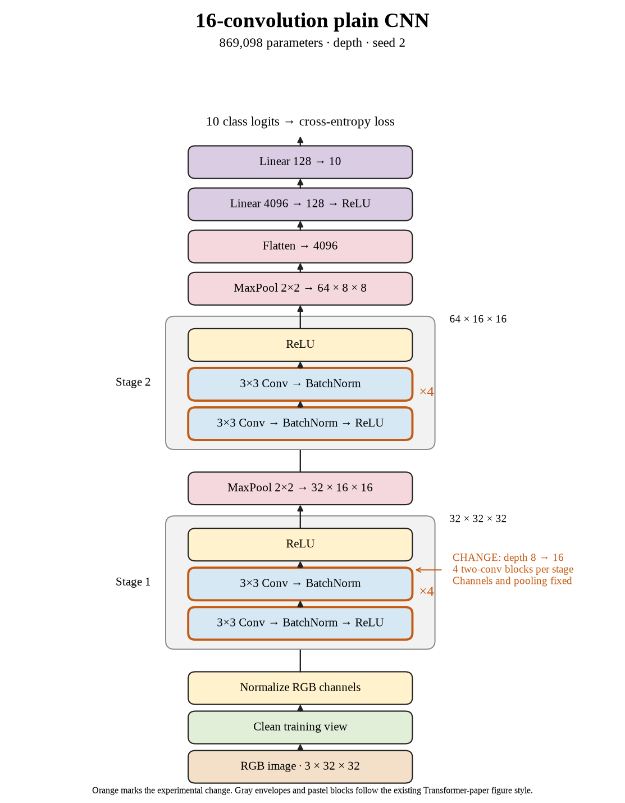

# 60. Is sixteen-layer depth worth its cost for seed 2? (Oct 1, 2026)

<!-- experiment-key: depth/plain/conv-16/seed-2 -->

**TL;DR:** Doubling plain depth improved seed 2 by only 0.07 validation percentage points while roughly doubling training and evaluation time.

**Problem.** I want more depth to earn its extra computation. The strongest eight-layer seed was already doing well. I needed to check whether sixteen layers helped that same seed.

*How we know:* seed 2's eight-convolution control scored 87.39% on validation and reached 100% clean training accuracy. More capacity could help unseen images or add very little.

**Experiment.** I doubled depth to sixteen convolutions, arranging four two-convolution blocks per stage. I kept widths, pooling, the classifier, normalization, and learning-rate schedule fixed. Seed 2 trained for 160 epochs on the same 45,000/5,000 training/validation split, with batch size 128 and no augmentation.

*What we hope to learn:* a clear gain would justify deeper feature processing. A tiny gain would make depth an expensive improvement.

**Outcome.** The last-ten-epoch validation score reached 87.46%; final-epoch validation accuracy was 87.50%:

- Both models achieved 100% clean training accuracy, like two students mastering the same practice questions. The practice score cannot decide between them.
- Final validation loss increased from 0.465 to 0.475. Loss grades confidence as well as correctness, like charging more for a confidently wrong answer. This difference does not identify which images or mechanism caused it.

Training plus evaluation took 16.5 minutes versus 8.2. The paired three-seed gain was +0.271 points, our first low-gain increase. The queue continues to thirty-two layers because stopping requires two consecutive low-gain increases or the separate decline rule.

**Takeaway:** I should weigh marginal benefit against runtime. More layers do not guarantee progress, and the test set remains held out.

Source: [completed run](https://wandb.ai/7adamyasingh-rutgers-university/cifar-activity/runs/5lk90ff9), `runs/depth/plain/conv-16/seed-2/summary.json`; control: `runs/depth/plain/conv-8/seed-2/summary.json`.

<!-- experiment-architecture -->

Figure exports: [SVG](../../figures/experiments/depth-plain-conv-16-seed-2.svg) · [PDF](../../figures/experiments/depth-plain-conv-16-seed-2.pdf). Orange marks what changed; the diagram shows the trained architecture.
