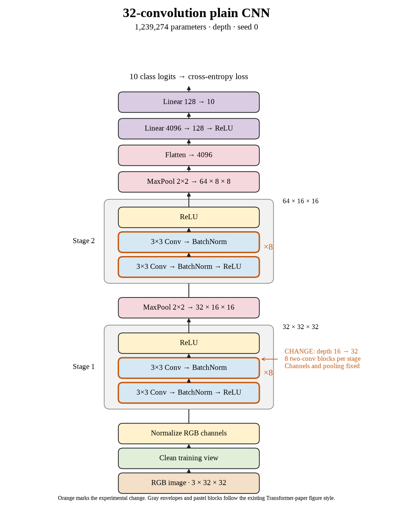

# 61. Does thirty-two-layer plain depth still help seed 0? (Oct 1, 2026)

<!-- experiment-key: depth/plain/conv-32/seed-0 -->

**TL;DR:** I lost 3.48 validation percentage points by doubling plain depth again, while training and evaluation time nearly doubled.

**Problem.** I want to find where depth stops helping under our fixed training recipe. Sixteen layers added only a small gain, so another increase needed to justify its extra computation.

*How we know:* the sixteen-convolution seed-0 control scored 87.13% on validation and reached 100% clean training accuracy. I still needed to test the deepest candidate and compare the remaining seeds.

**Experiment.** I increased depth to thirty-two convolutions, with eight two-convolution blocks in each stage. Widths, pooling, normalization, and the classifier stayed fixed. I kept seed 0, the 160-epoch recipe, batch size 128, and the same 45,000/5,000 training/validation split without augmentation.

*What we hope to learn:* an improvement would support more plain depth. A decline would make matched shortcut experiments especially useful for understanding this limit.

**Outcome.** The last-ten-epoch validation score fell to 83.65%; final-epoch validation accuracy was 83.64%:

- Clean training accuracy still reached 100%, like a student acing the practice sheet while doing worse on fresh questions. Final training loss was 0.0025 versus 0.0015; the final fit alone cannot explain the learning dynamics.
- Final validation loss increased from 0.495 to 0.601. Loss evaluates confidence too, like deducting extra points for a confidently wrong answer. The wider training/validation gap supports concern about generalization, without identifying its cause.

Training plus evaluation took 33.0 minutes versus 16.7. I will finish the other two seeds before classifying the depth-level result; the queue's decline rule requires paired evidence across seeds.

**Takeaway:** More depth reduced validation performance for this seed. Matched residual runs will test shortcuts that carry activations around blocks; their results and test performance remain unknown.

Source: [completed run](https://wandb.ai/7adamyasingh-rutgers-university/cifar-activity/runs/jfml9rdo), `runs/depth/plain/conv-32/seed-0/summary.json`; control: `runs/depth/plain/conv-16/seed-0/summary.json`.

<!-- experiment-architecture -->

Figure exports: [SVG](../../figures/experiments/depth-plain-conv-32-seed-0.svg) · [PDF](../../figures/experiments/depth-plain-conv-32-seed-0.pdf). Orange marks what changed; the diagram shows the trained architecture.
