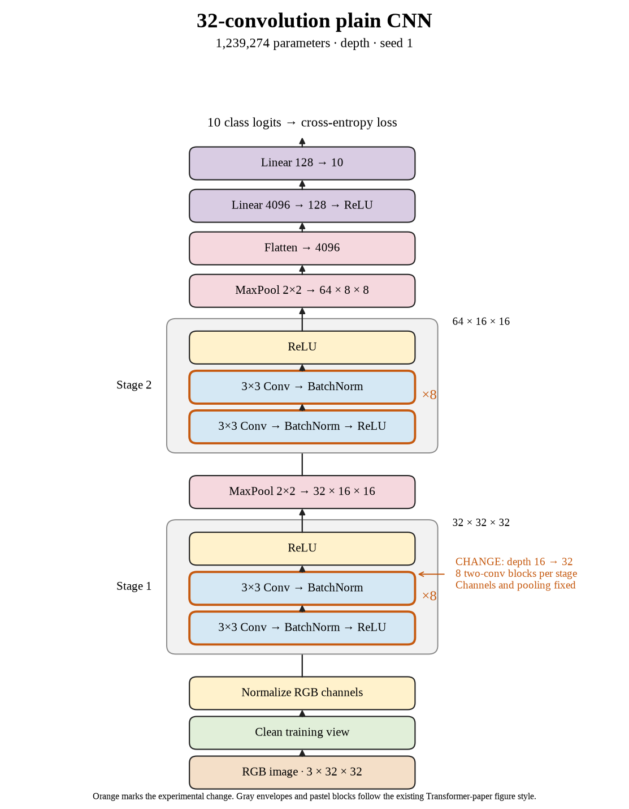

# 62. Does thirty-two-layer plain depth also hurt seed 1? (Oct 1, 2026)

<!-- experiment-key: depth/plain/conv-32/seed-1 -->

**TL;DR:** I lost 3.78 validation percentage points on seed 1 after doubling plain depth, with almost twice the training and evaluation time.

**Problem.** I need to check deeper models across random starts. More layers should earn their runtime cost, and a single seed cannot establish the depth-level result.

*How we know:* the sixteen-convolution seed-1 control scored 86.93% on validation with 100% clean training accuracy. The remaining question was whether thirty-two layers improved performance on unseen images.

**Experiment.** I trained thirty-two plain convolutions for 160 epochs, using eight two-convolution blocks per stage. I kept seed 1, widths, pooling, the classifier, normalization, and the optimizer recipe fixed. Both depths used batch size 128 and the same 45,000/5,000 training/validation split without augmentation.

*What we hope to learn:* an improvement would support deeper feature processing. A decline would strengthen the case for testing residual shortcuts, basically paths around blocks, at the same depths.

**Outcome.** The last-ten-epoch validation score was 83.15%; final-epoch validation accuracy was 83.08%:

- Clean training accuracy remained 100%, like memorizing a practice worksheet while getting fewer fresh questions right. Clean training loss rose from 0.0014 to 0.0027. Those final values establish a fitted training set, without explaining the earlier learning dynamics.
- Final validation loss rose from 0.493 to 0.609. Accuracy grades answers as correct or wrong; loss also grades confidence, like charging extra for an emphatic mistake. Both validation measures worsened here.

Training plus evaluation took 33.2 minutes versus 16.6. I will complete the three-seed comparison before classifying the depth-level decline; the preset rule uses their paired mean and decline count.

**Takeaway:** Adding plain depth hurt this completed run under our recipe. Matched shortcut experiments can test whether changing the block helps; test images remain held out.

Source: [completed run](https://wandb.ai/7adamyasingh-rutgers-university/cifar-activity/runs/otcotur2), `runs/depth/plain/conv-32/seed-1/summary.json`; control: `runs/depth/plain/conv-16/seed-1/summary.json`.

<!-- experiment-architecture -->

Figure exports: [SVG](../../figures/experiments/depth-plain-conv-32-seed-1.svg) · [PDF](../../figures/experiments/depth-plain-conv-32-seed-1.pdf). Orange marks what changed; the diagram shows the trained architecture.
