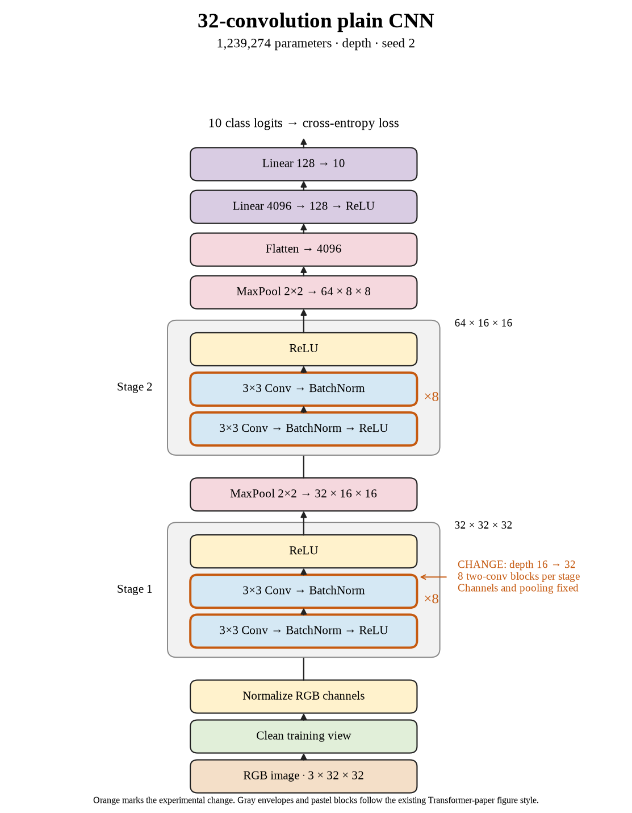

# 63. Where did plain depth stop helping? (Oct 1, 2026)

<!-- experiment-key: depth/plain/conv-32/seed-2 -->

**TL;DR:** I lost 5.03 validation percentage points on seed 2 at thirty-two convolutions, completing a three-seed decline that stops the plain sweep.

**Problem.** I want extra depth to improve accuracy on unseen images. The sixteen-layer model already fits every training image, so more layers need to earn their cost on validation.

*How we know:* the matched sixteen-convolution control scored 87.46% over its last ten epochs. Two completed thirty-two-layer seeds also declined, but the stopping decision required all three.

**Experiment.** I trained thirty-two plain convolutions for 160 epochs: eight two-convolution blocks in each stage. I kept seed 2, the 32/64-channel widths, pooling, dense classifier, batch normalization, and training recipe fixed. Both models used the same 45,000/5,000 training/validation split without augmentation.

*What we hope to learn:* a gain would support increasing depth. A repeated decline would stop this sweep and move us to matched residual blocks, which add a path around each block.

**Outcome.** The last-ten-epoch validation score fell to 82.43%; final validation accuracy was 82.40%:

- Clean training accuracy stayed at 100%, like completing the practice sheet perfectly while struggling on fresh questions. That establishes final training fit; it does not identify what happened earlier during optimization.
- Final validation loss rose from 0.475 to 0.643. Loss considers confidence too, like charging extra for a confident wrong answer. Both validation measures worsened.

Training plus evaluation took 33.4 minutes versus 16.5. Across all three seeds, the paired mean change was −4.10 points, with three declines. The queue saved the decline decision and proceeds through residual depths 4, 8, 16, and 32.

**Takeaway:** Plain depth stopped helping under this recipe. I will test shortcuts at matched depths while keeping test images held out.

Source: [completed run](https://wandb.ai/7adamyasingh-rutgers-university/cifar-activity/runs/7u1kjhiy), `runs/depth/plain/conv-32/seed-2/summary.json`; control: `runs/depth/plain/conv-16/seed-2/summary.json`.

<!-- experiment-architecture -->

Figure exports: [SVG](../../figures/experiments/depth-plain-conv-32-seed-2.svg) · [PDF](../../figures/experiments/depth-plain-conv-32-seed-2.pdf). Orange marks what changed; the diagram shows the trained architecture.
