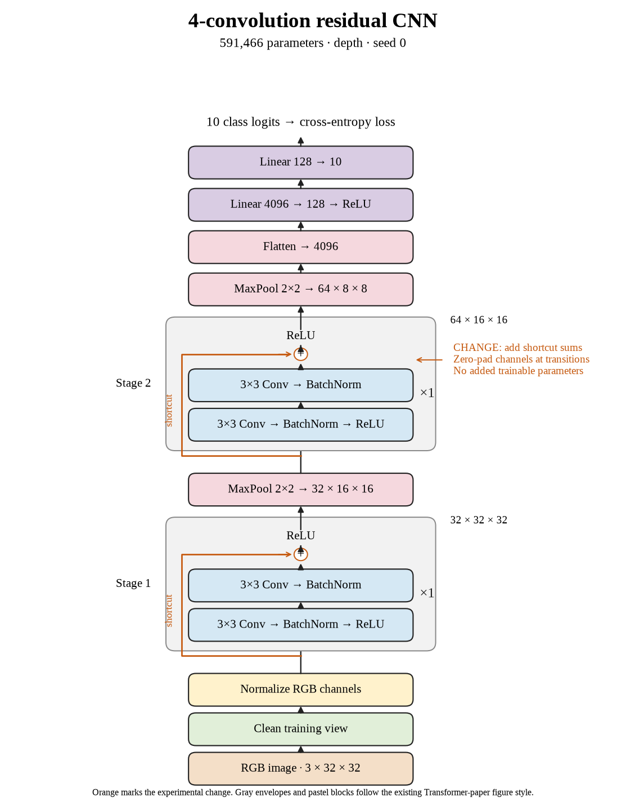

# 64. Do shortcuts help the four-convolution model? (Oct 1, 2026)

<!-- experiment-key: depth/residual/conv-4/seed-0 -->

**TL;DR:** I added residual shortcuts at four convolutions and got 84.06% validation, 0.15 percentage points below the matched plain seed-0 control.

**Problem.** The plain sweep declined at thirty-two convolutions. I now want to test whether shortcuts improve the same architectures, starting with the shallowest eligible depth.

*How we know:* the four-convolution plain seed-0 control scored 84.20% over its last ten epochs and reached 100% clean training accuracy. This comparison can isolate the shortcut change within our fixed recipe.

**Experiment.** I trained one two-convolution residual block per stage for 160 epochs. Each block adds its input before the final ReLU, which clips negative values to zero. I kept the widths, pooling, classifier, batch normalization, seed, split, and optimizer recipe fixed. Paired models start with identical weights and image shuffle sequences; both contain 591,466 trainable parameters.

*What we hope to learn:* a gain would suggest shortcuts help even at shallow depth. A flat or lower score would leave their usefulness at deeper architectures open.

**Outcome.** The last-ten-epoch validation score was 84.06%; final validation accuracy was 83.98%:

- The shortcut supplies a direct route around two convolutions, like a side road alongside two processing stops. At channel changes, zero padding adds blank channels rather than learned projection weights, so the comparison keeps parameter counts equal.
- Both models reached 100% clean training accuracy, like acing the same practice sheet. Final validation loss rose from 0.555 to 0.582, so perfect training fit did not translate into better validation here.

Training plus evaluation took 5.3 minutes versus 4.6. I will finish all three seeds and every scheduled residual depth before drawing the broader comparison. No test evaluation was used.

**Takeaway:** A shortcut does not guarantee an accuracy gain at four convolutions. This completed seed is one paired observation, not the depth-level result.

Source: [completed run](https://wandb.ai/7adamyasingh-rutgers-university/cifar-activity/runs/nhc5dx96), `runs/depth/residual/conv-4/seed-0/summary.json`; control: `runs/depth/plain/conv-4/seed-0/summary.json`.

<!-- experiment-architecture -->

Figure exports: [SVG](../../figures/experiments/depth-residual-conv-4-seed-0.svg) · [PDF](../../figures/experiments/depth-residual-conv-4-seed-0.pdf). Orange marks what changed; the diagram shows the trained architecture.
