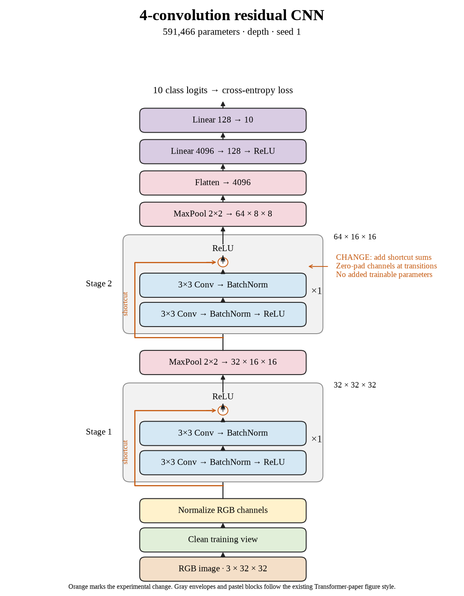

# 65. Does the shallow shortcut result hold for seed 1? (Oct 1, 2026)

<!-- experiment-key: depth/residual/conv-4/seed-1 -->

**TL;DR:** I got 83.04% validation with four residual convolutions on seed 1, losing 1.70 percentage points against its matched plain control.

**Problem.** The first four-layer residual seed did not improve validation. I need paired results across random starts before deciding whether this shallow architecture benefits from shortcuts.

*How we know:* the plain seed-1 control scored 84.75% over its last ten epochs. Seed 0 lost 0.15 points after adding shortcuts, but that result alone could not establish a consistent depth-level effect.

**Experiment.** I trained four residual convolutions for 160 epochs, with one two-convolution block per stage. Each shortcut adds the block input before the final ReLU, which clips negative outputs to zero. I kept seed 1, the widths, pooling, classifier, batch normalization, and optimizer recipe fixed. The pair shares initial weights, shuffle sequences, and the same 45,000/5,000 split without augmentation.

*What we hope to learn:* an improvement would show that the first seed's result does not carry across random starts. Another decline would strengthen the shallow comparison while leaving deeper shortcut results undecided.

**Outcome.** The last-ten-epoch validation score was 83.04%; final validation accuracy was 83.00%:

- Both models reached 100% clean training accuracy, like answering every practice question correctly. Final training fit therefore does not explain the validation difference or prove a particular optimization problem.
- Final validation loss rose from 0.532 to 0.606. Accuracy counts wrong answers; loss also weighs confidence, like a larger penalty for being confidently wrong. Both measures worsened in this pair.

Both models contain 591,466 trainable parameters. Training plus evaluation took 5.2 minutes versus 4.6. I will complete seed 2 before calculating the three-seed result; the queue still tests every visited residual depth. Test images remain held out.

**Takeaway:** Two shallow shortcut seeds have declined, with different magnitudes. I need the completed matched group before making a depth-level claim.

Source: [completed run](https://wandb.ai/7adamyasingh-rutgers-university/cifar-activity/runs/wl1pl5sh), `runs/depth/residual/conv-4/seed-1/summary.json`; control: `runs/depth/plain/conv-4/seed-1/summary.json`.

<!-- experiment-architecture -->

Figure exports: [SVG](../../figures/experiments/depth-residual-conv-4-seed-1.svg) · [PDF](../../figures/experiments/depth-residual-conv-4-seed-1.pdf). Orange marks what changed; the diagram shows the trained architecture.
