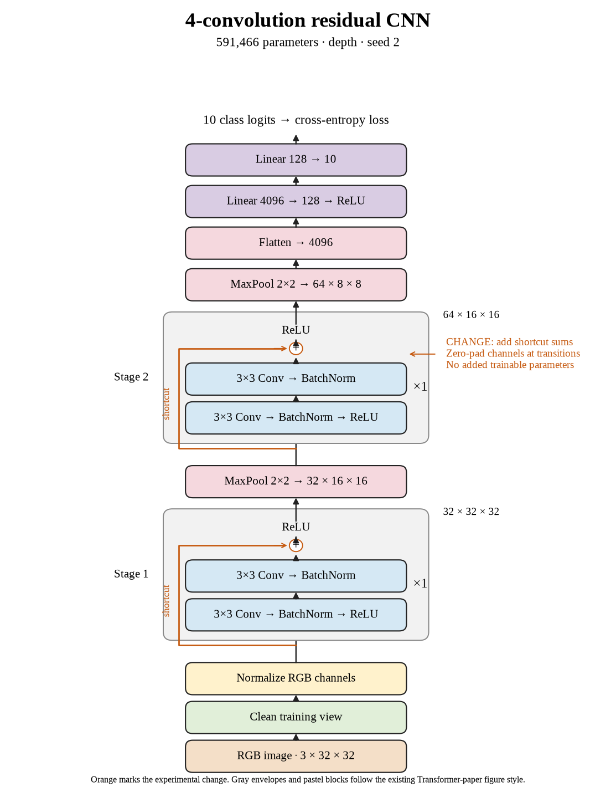

# 66. Did four-layer shortcuts help across all three seeds? (Oct 1, 2026)

<!-- experiment-key: depth/residual/conv-4/seed-2 -->

**TL;DR:** I lost 0.45 validation percentage points on seed 2, completing a four-convolution residual group that trails plain by 0.77 points on average.

**Problem.** Shortcuts did not improve either completed shallow seed. I need the third matched run to finish the comparison, since different random starts can produce different results.

*How we know:* the plain seed-2 control scored 84.65% over its last ten epochs. The other residual seeds declined by 0.15 and 1.70 points; the remaining question was whether seed 2 would reverse that pattern.

**Experiment.** I trained four residual convolutions for 160 epochs, with one two-convolution block per stage and a shortcut that adds its input before the final ReLU, which clips negative values to zero. I kept seed 2, initial weights, shuffle sequences, widths, pooling, classifier, batch normalization, training recipe, and the 45,000/5,000 split fixed, without augmentation.

*What we hope to learn:* a gain would show mixed shallow results. Another decline would establish that all three matched shallow runs favored plain under this recipe.

**Outcome.** The last-ten-epoch validation score was 84.20%; final validation accuracy was 84.22%:

- Both models reached 100% clean training accuracy, like acing the same practice sheet. That confirms final training fit without explaining why validation differs.
- Final validation loss rose from 0.545 to 0.557. Loss also considers confidence, like charging more for a confident wrong answer. Both validation measures slightly worsened here.

Both models have 591,466 trainable parameters. Training plus evaluation took 5.2 minutes versus 4.6. All three paired scores declined, averaging −0.77 points. I will continue the scheduled residual depths 8, 16, and 32; test images remain held out.

**Takeaway:** Four-layer shortcuts did not help this completed group. Their effect at greater depth still needs its own matched experiments.

Source: [completed run](https://wandb.ai/7adamyasingh-rutgers-university/cifar-activity/runs/grwur3d1), `runs/depth/residual/conv-4/seed-2/summary.json`; control: `runs/depth/plain/conv-4/seed-2/summary.json`.

<!-- experiment-architecture -->

Figure exports: [SVG](../../figures/experiments/depth-residual-conv-4-seed-2.svg) · [PDF](../../figures/experiments/depth-residual-conv-4-seed-2.pdf). Orange marks what changed; the diagram shows the trained architecture.
