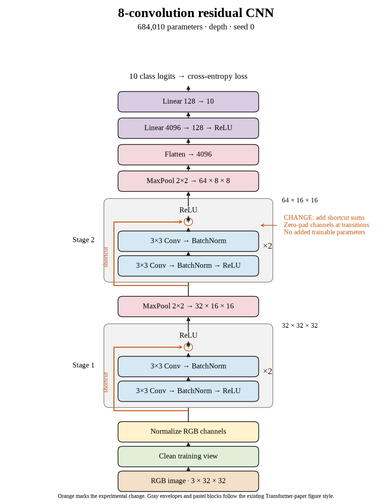

# 67. Do shortcuts help at eight convolutions on seed 0? (Oct 1, 2026)

<!-- experiment-key: depth/residual/conv-8/seed-0 -->

**TL;DR:** I got 86.45% validation with eight residual convolutions, 0.33 percentage points below the matched plain seed-0 control.

**Problem.** Four-layer shortcuts lost accuracy across all three seeds. I want to see whether their usefulness changes with depth, since a shallow comparison cannot answer that question.

*How we know:* the eight-convolution plain seed-0 control scored 86.79% over its last ten epochs. The completed four-layer group favored plain by 0.77 points on average; deeper matched results were still unknown.

**Experiment.** I trained eight residual convolutions for 160 epochs, with two two-convolution blocks per stage and shortcuts that add each block's input before its final ReLU, which clips negative values to zero. I kept the paired seed, initial weights, shuffle sequences, widths, pooling, classifier, training recipe, and 45,000/5,000 split fixed, without augmentation.

*What we hope to learn:* an improvement would suggest shortcuts become useful at this depth. A decline would leave that possibility open for the remaining seeds and deeper models.

**Outcome.** The last-ten-epoch validation score was 86.45%; final validation accuracy was 86.40%:

- Both models reached 100% clean training accuracy. Residual clean training loss was lower, 0.00185 versus 0.00225, like answering the same practice questions with greater confidence. That did not improve validation accuracy.
- Final validation loss rose slightly from 0.469 to 0.475. Loss grades confidence as well as correctness, like charging extra for a confident mistake. Both validation measures favored plain here.

Both models contain 684,010 trainable parameters. Training plus evaluation took 9.0 minutes versus 8.5. I will finish the other two seeds before calculating the depth-level result; test images remain held out.

**Takeaway:** This seed offers no validation gain from eight-layer shortcuts. Better training loss alone does not establish better performance on unseen images.

Source: [completed run](https://wandb.ai/7adamyasingh-rutgers-university/cifar-activity/runs/ehu86xff), `runs/depth/residual/conv-8/seed-0/summary.json`; control: `runs/depth/plain/conv-8/seed-0/summary.json`.

<!-- experiment-architecture -->

Figure exports: [SVG](../../figures/experiments/depth-residual-conv-8-seed-0.svg) · [PDF](../../figures/experiments/depth-residual-conv-8-seed-0.pdf). Orange marks what changed; the diagram shows the trained architecture.
