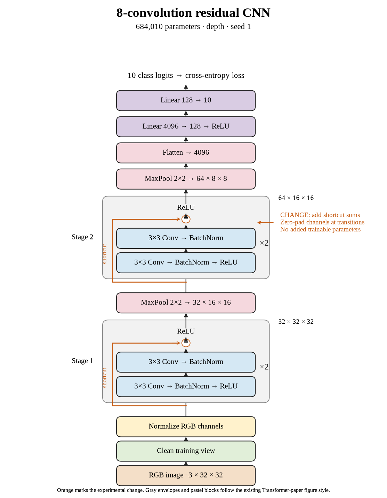

# 68. Can eight-layer shortcuts improve seed 1? (Oct 1, 2026)

<!-- experiment-key: depth/residual/conv-8/seed-1 -->

**TL;DR:** I gained 0.49 validation percentage points with eight residual convolutions on seed 1, while final validation loss increased slightly.

**Problem.** Eight-layer shortcuts lost accuracy on seed 0. I need the other paired seeds to see whether that result repeats, since one random start cannot establish the architecture's effect.

*How we know:* the plain seed-1 control scored 86.53% over its last ten epochs. The first eight-layer residual seed lost 0.33 points; I did not yet know whether the remaining pairs would also decline.

**Experiment.** I trained eight residual convolutions for 160 epochs, using two two-convolution blocks per stage with shortcuts that add each block's input before its final ReLU, which clips negative values to zero. I kept the paired initial weights, shuffle sequences, seed, widths, pooling, classifier, recipe, and 45,000/5,000 split fixed, without augmentation.

*What we hope to learn:* a gain would show mixed results at this depth. Another decline would strengthen the case that eight-layer shortcuts do not help under this recipe.

**Outcome.** The last-ten-epoch validation score reached 87.02%; final validation accuracy was 87.04%:

- Both models reached 100% clean training accuracy. Residual clean training loss fell from 0.00227 to 0.00179, like answering the same practice questions more confidently. Final training accuracy alone cannot distinguish these models.
- Final validation loss increased from 0.480 to 0.485 despite higher accuracy. Accuracy counts correct answers; loss also grades confidence, like charging extra for an emphatic mistake. The two measures need not move together.

Both models contain 684,010 trainable parameters. Training plus evaluation took 8.9 minutes versus 8.4. I will finish seed 2 before calculating the three-seed comparison. Test images remain held out.

**Takeaway:** This completed seed benefits in validation accuracy, but eight-layer shortcuts have mixed paired results so far. I need the full group before choosing between architectures.

Source: [completed run](https://wandb.ai/7adamyasingh-rutgers-university/cifar-activity/runs/h6i6lk0n), `runs/depth/residual/conv-8/seed-1/summary.json`; control: `runs/depth/plain/conv-8/seed-1/summary.json`.

<!-- experiment-architecture -->

Figure exports: [SVG](../../figures/experiments/depth-residual-conv-8-seed-1.svg) · [PDF](../../figures/experiments/depth-residual-conv-8-seed-1.pdf). Orange marks what changed; the diagram shows the trained architecture.
