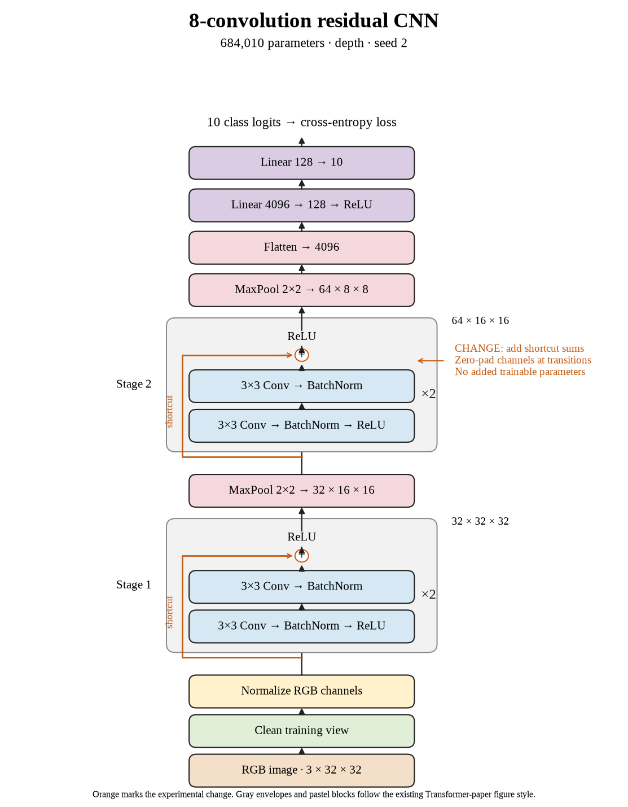

# 69. What did the complete eight-layer shortcut comparison show? (Oct 1, 2026)

<!-- experiment-key: depth/residual/conv-8/seed-2 -->

**TL;DR:** I lost 0.86 validation percentage points on seed 2, leaving eight-layer residual models 0.24 points below plain on the three-seed paired mean.

**Problem.** The first two eight-layer shortcut results pointed in different directions. I need the final matched seed before judging this depth, because a favorable run can hide variation across random starts.

*How we know:* the plain seed-2 control scored 87.39% over its last ten epochs. Residual seed 0 lost 0.33 points, while seed 1 gained 0.49; the completed group's direction was still undecided.

**Experiment.** I trained eight residual convolutions for 160 epochs, with two two-convolution blocks per stage and shortcuts that add each block's input before its final ReLU, which clips negative values to zero. I kept paired initial weights, shuffle sequences, seed, widths, pooling, classifier, recipe, and the 45,000/5,000 split fixed, without augmentation.

*What we hope to learn:* a gain could turn the group's average positive. A decline would show that the isolated favorable seed did not establish an average improvement.

**Outcome.** The last-ten-epoch validation score was 86.53%; final validation accuracy was 86.48%:

- Both models reached 100% clean training accuracy. Residual clean training loss fell from 0.00230 to 0.00180, like answering the same practice sheet more confidently. Better training confidence did not improve validation here.
- Final validation loss rose from 0.465 to 0.488. Loss weighs confidence too, like a larger penalty for a confident wrong answer. Both validation measures favored plain in this pair.

Both models have 684,010 trainable parameters. Training plus evaluation took 8.9 minutes versus 8.2. Two seeds declined and one improved, averaging −0.24 points. I will continue residual depths 16 and 32; test images remain held out.

**Takeaway:** Eight-layer shortcuts produced mixed results without an average gain. Compare complete paired groups before treating one improved run as an architectural advantage.

Source: [completed run](https://wandb.ai/7adamyasingh-rutgers-university/cifar-activity/runs/ea4sv2km), `runs/depth/residual/conv-8/seed-2/summary.json`; control: `runs/depth/plain/conv-8/seed-2/summary.json`.

<!-- experiment-architecture -->

Figure exports: [SVG](../../figures/experiments/depth-residual-conv-8-seed-2.svg) · [PDF](../../figures/experiments/depth-residual-conv-8-seed-2.pdf). Orange marks what changed; the diagram shows the trained architecture.
