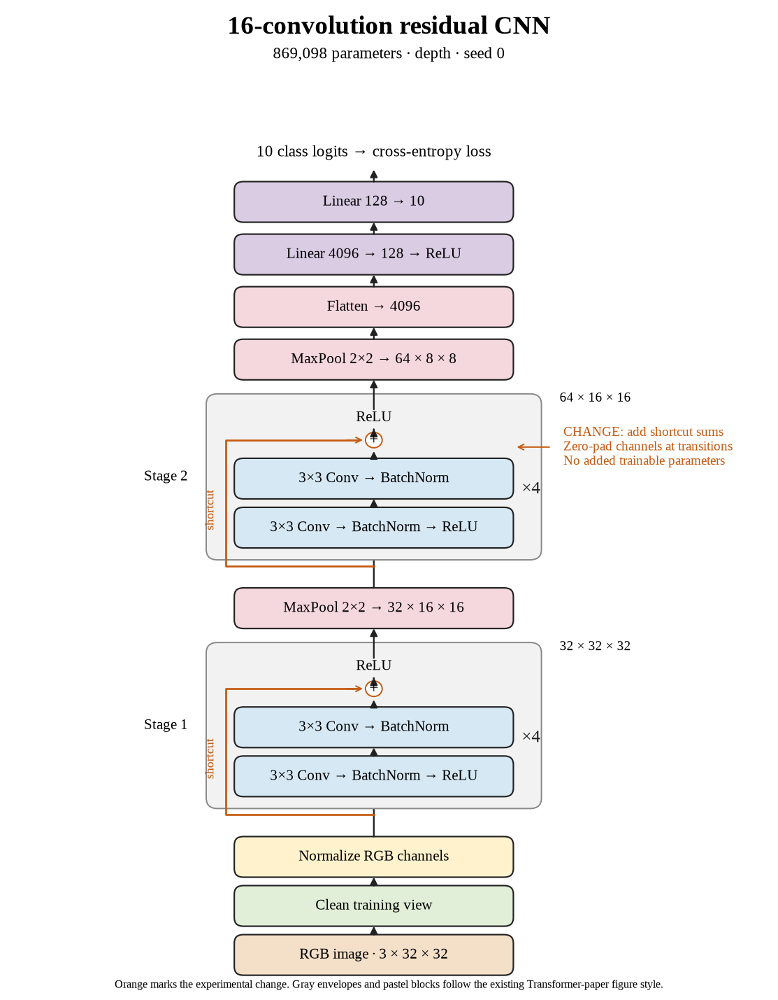

# 70. Do sixteen-layer shortcuts help seed 0? (Oct 1, 2026)

<!-- experiment-key: depth/residual/conv-16/seed-0 -->

**TL;DR:** I got 86.40% validation with sixteen residual convolutions, losing 0.73 percentage points against the matched plain seed-0 control.

**Problem.** Shortcuts have not improved the average validation score at four or eight convolutions. I want to test their effect at sixteen layers, where plain depth had started providing smaller gains.

*How we know:* the sixteen-convolution plain seed-0 control scored 87.13% over its last ten epochs. That model already reached 100% clean training accuracy; I did not know whether shortcuts would improve its performance on unseen images.

**Experiment.** I trained sixteen residual convolutions for 160 epochs, using four two-convolution blocks per stage and shortcuts that add each block's input before its final ReLU, which clips negative values to zero. I kept paired initial weights, shuffle sequences, seed, widths, pooling, classifier, training recipe, and the 45,000/5,000 split fixed, without augmentation.

*What we hope to learn:* a gain would support shortcuts at greater depth. A decline would leave that hypothesis open for the other seeds and the thirty-two-layer comparison.

**Outcome.** The last-ten-epoch validation score was 86.40%; final validation accuracy was 86.42%:

- Both models reached 100% clean training accuracy. Residual clean training loss fell from 0.00148 to 0.00131, like answering the same practice sheet more confidently. Better training confidence did not improve validation here.
- Final validation loss rose from 0.495 to 0.523. Loss considers confidence too, like charging extra for an emphatic wrong answer. Both validation measures favored plain in this pair.

Both models contain 869,098 trainable parameters. Training plus evaluation took 17.6 minutes versus 16.7. I will complete the other two seeds before calculating the depth-level comparison. Test images remain held out.

**Takeaway:** Sixteen-layer shortcuts did not help this completed seed. Final training fit and validation performance answer different questions, so I need both when comparing architectures.

Source: [completed run](https://wandb.ai/7adamyasingh-rutgers-university/cifar-activity/runs/uvr8gvq1), `runs/depth/residual/conv-16/seed-0/summary.json`; control: `runs/depth/plain/conv-16/seed-0/summary.json`.

<!-- experiment-architecture -->

Figure exports: [SVG](../../figures/experiments/depth-residual-conv-16-seed-0.svg) · [PDF](../../figures/experiments/depth-residual-conv-16-seed-0.pdf). Orange marks what changed; the diagram shows the trained architecture.
