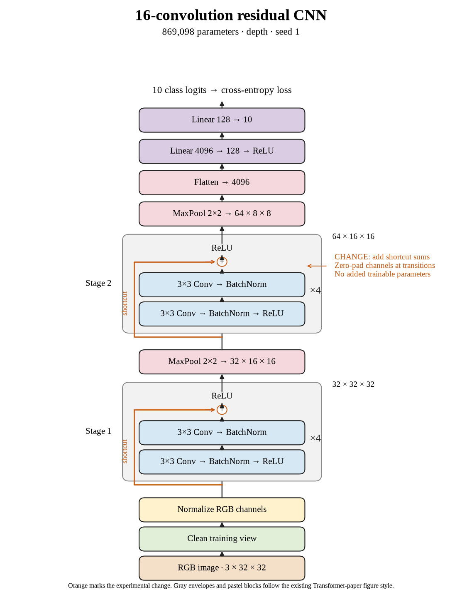

# 71. Do sixteen-layer shortcuts improve seed 1? (Oct 1, 2026)

<!-- experiment-key: depth/residual/conv-16/seed-1 -->

**TL;DR:** I got 86.85% validation with sixteen residual convolutions on seed 1, 0.09 percentage points below its matched plain control.

**Problem.** Sixteen-layer shortcuts lost accuracy on seed 0. I need the remaining paired seeds to see whether that result repeats and how much it varies across random starts.

*How we know:* the plain seed-1 control scored 86.93% over its last ten epochs. The first residual pair lost 0.73 points; I did not yet know whether the next seed would improve or decline.

**Experiment.** I trained sixteen residual convolutions for 160 epochs, using four two-convolution blocks per stage with shortcuts that add each block's input before its final ReLU, which clips negative values to zero. I kept paired initial weights, shuffle sequences, seed, widths, pooling, classifier, recipe, and the 45,000/5,000 split fixed, without augmentation.

*What we hope to learn:* a gain would make the sixteen-layer results mixed. Another decline would strengthen the paired comparison, while leaving the three-seed mean unfinished.

**Outcome.** The last-ten-epoch validation score was 86.85%; final validation accuracy was 86.84%:

- Both models reached 100% clean training accuracy. Residual clean training loss fell from 0.00135 to 0.00102, like answering the same practice sheet more confidently. That confidence did not produce higher validation accuracy.
- Final validation loss rose from 0.493 to 0.510. Accuracy counts correct answers; loss also weighs confidence, like charging extra for an emphatic mistake. Both validation measures favored plain in this pair.

Both models contain 869,098 trainable parameters. Training plus evaluation took 17.7 minutes versus 16.6. I will finish seed 2 before calculating the depth-level result; the thirty-two-layer shortcut experiments remain scheduled. Test images stay held out.

**Takeaway:** This pair slightly favors plain, without establishing a reliable difference by itself. I need the completed group before judging sixteen-layer shortcuts under this recipe.

Source: [completed run](https://wandb.ai/7adamyasingh-rutgers-university/cifar-activity/runs/2bykrlyb), `runs/depth/residual/conv-16/seed-1/summary.json`; control: `runs/depth/plain/conv-16/seed-1/summary.json`.

<!-- experiment-architecture -->

Figure exports: [SVG](../../figures/experiments/depth-residual-conv-16-seed-1.svg) · [PDF](../../figures/experiments/depth-residual-conv-16-seed-1.pdf). Orange marks what changed; the diagram shows the trained architecture.
