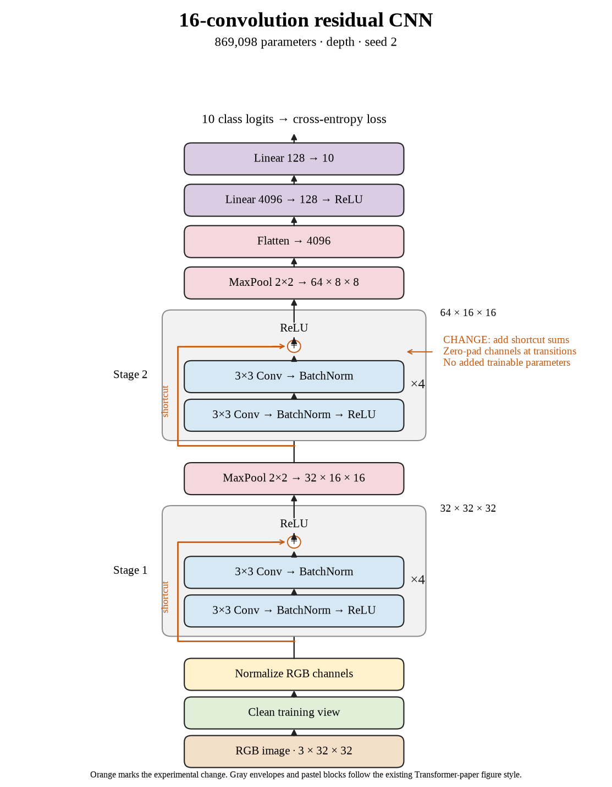

# 72. What did the complete sixteen-layer shortcut comparison show? (Oct 1, 2026)

<!-- experiment-key: depth/residual/conv-16/seed-2 -->

**TL;DR:** I lost 0.16 validation percentage points on seed 2, completing a sixteen-layer residual group that trails plain by 0.33 points on average.

**Problem.** Sixteen-layer shortcuts slightly reduced accuracy on the first two seeds. I need the final matched run to finish this depth's comparison before judging the architecture.

*How we know:* the plain seed-2 control scored 87.46% over its last ten epochs. The other residual pairs lost 0.73 and 0.09 points; I did not yet know whether the third seed would improve.

**Experiment.** I trained sixteen residual convolutions for 160 epochs, using four two-convolution blocks per stage with shortcuts that add each block's input before its final ReLU, which clips negative values to zero. I kept paired initial weights, shuffle sequences, seed, widths, pooling, classifier, recipe, and the 45,000/5,000 split fixed, without augmentation.

*What we hope to learn:* a gain would show mixed results across random starts. Another decline would establish that all three completed pairs favored plain at this depth.

**Outcome.** The last-ten-epoch validation score was 87.29%; final validation accuracy was 87.34%:

- Both models reached 100% clean training accuracy. Residual clean training loss fell from 0.00159 to 0.00125, like answering the same practice sheet more confidently. That extra confidence did not improve validation accuracy.
- Final validation loss rose from 0.475 to 0.501. Loss considers confidence too, like charging extra for an emphatic wrong answer. Both validation measures favored plain in this pair.

Both models contain 869,098 trainable parameters. Training plus evaluation took 17.6 minutes versus 16.5. All three paired scores declined, averaging −0.33 points. I will continue the scheduled thirty-two-layer residual experiments; test images remain held out.

**Takeaway:** Sixteen-layer shortcuts did not improve this completed group's average validation score. The depth where plain accuracy fell sharply still needs its own matched shortcut comparison.

Source: [completed run](https://wandb.ai/7adamyasingh-rutgers-university/cifar-activity/runs/35bwnpnx), `runs/depth/residual/conv-16/seed-2/summary.json`; control: `runs/depth/plain/conv-16/seed-2/summary.json`.

<!-- experiment-architecture -->

Figure exports: [SVG](../../figures/experiments/depth-residual-conv-16-seed-2.svg) · [PDF](../../figures/experiments/depth-residual-conv-16-seed-2.pdf). Orange marks what changed; the diagram shows the trained architecture.
