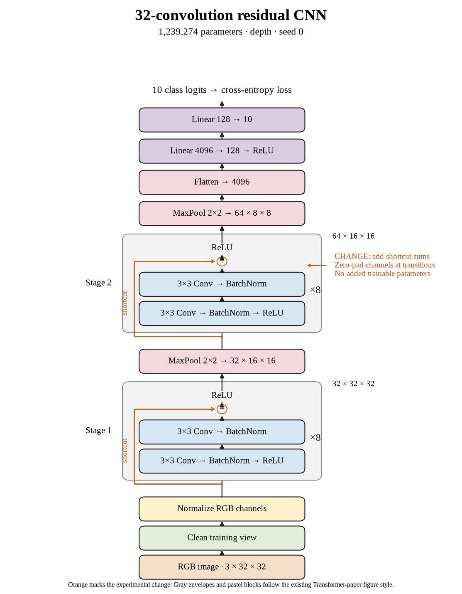

# 73. Can shortcuts recover the thirty-two-layer accuracy drop? (Oct 1, 2026)

<!-- experiment-key: depth/residual/conv-32/seed-0 -->

**TL;DR:** I gained 4.04 validation percentage points by adding shortcuts to thirty-two convolutions on seed 0, reaching 87.69%.

**Problem.** Plain accuracy fell sharply at thirty-two layers. Shallower shortcut groups did not improve their average scores, so I need to test the depth where the plain architecture actually struggled.

*How we know:* the thirty-two-convolution plain seed-0 control scored 83.65% over its last ten epochs despite 100% clean training accuracy. I did not know whether shortcuts could recover validation performance at the same depth.

**Experiment.** I trained thirty-two residual convolutions for 160 epochs, using eight two-convolution blocks per stage with shortcuts that add each block's input before its final ReLU, which clips negative values to zero. I kept paired initial weights, shuffle sequences, seed, widths, pooling, classifier, recipe, and the 45,000/5,000 split fixed, without augmentation.

*What we hope to learn:* a gain would support shortcuts at the depth where plain performance declined. A flat or lower score would show that this block change did not recover the lost accuracy for this seed.

**Outcome.** The last-ten-epoch validation score reached 87.69%; final validation accuracy was 87.68%:

- Each shortcut supplies a direct route around two convolutions, like a side road alongside two processing stops. The matched comparison measures this architectural change, but final metrics alone cannot explain its learning dynamics.
- Clean training accuracy stayed at 100%, while training loss fell from 0.00254 to 0.00102 and validation loss from 0.601 to 0.481. Like acing practice questions and doing better on fresh ones, the benefit extends beyond training confidence here.

Both models contain 1,239,274 trainable parameters. Training plus evaluation took 35.4 minutes versus 33.0. I will complete the remaining seeds before declaring a depth-level gain; test images remain held out.

**Takeaway:** Shortcuts recovered substantial validation accuracy in this deepest matched pair. Their usefulness depends on the tested architecture, so shallow results cannot settle the deeper comparison.

Source: [completed run](https://wandb.ai/7adamyasingh-rutgers-university/cifar-activity/runs/ddaz3vwj), `runs/depth/residual/conv-32/seed-0/summary.json`; control: `runs/depth/plain/conv-32/seed-0/summary.json`.

<!-- experiment-architecture -->

Figure exports: [SVG](../../figures/experiments/depth-residual-conv-32-seed-0.svg) · [PDF](../../figures/experiments/depth-residual-conv-32-seed-0.pdf). Orange marks what changed; the diagram shows the trained architecture.

<!-- final-test-assessment -->
Final assessment after the depth queue selected residual 32 by validation: this seed scored 86.78% test accuracy and 0.525 test loss. Source: `runs/depth/residual/conv-32/seed-0/test-summary.json`. This later assessment did not affect the validation-based selection.
