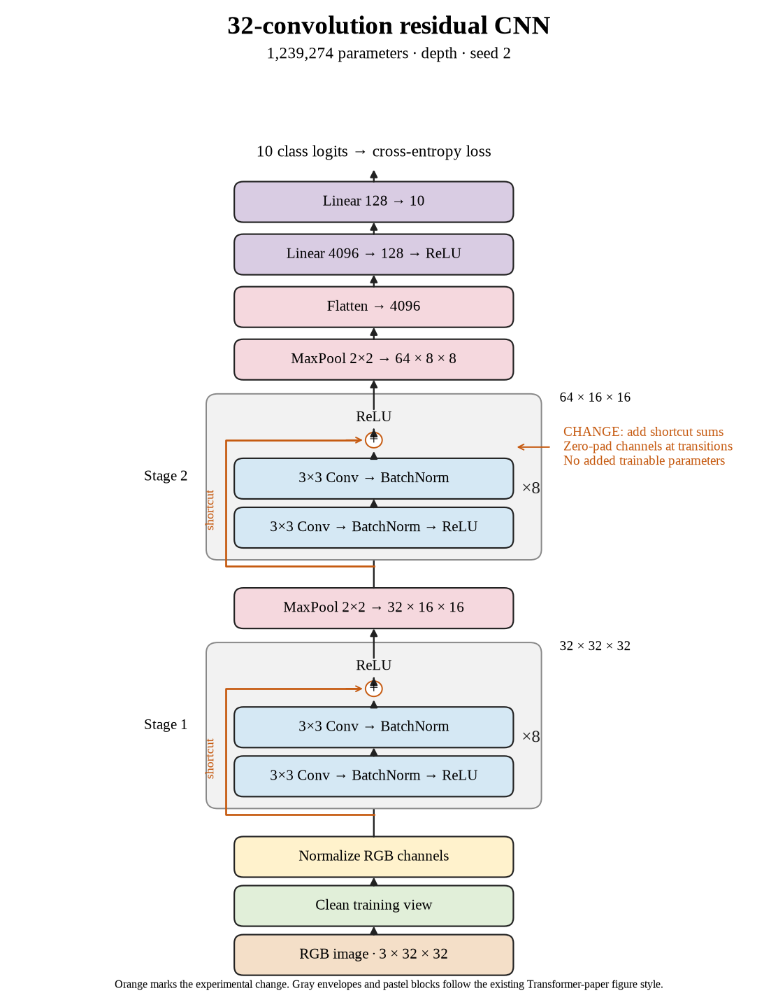

# 75. Do thirty-two-layer shortcuts recover accuracy on seed 2? (Oct 1, 2026)

<!-- experiment-key: depth/residual/conv-32/seed-2 -->

**TL;DR:** I gained 4.90 validation percentage points with thirty-two residual convolutions on seed 2, reaching 87.33%.

**Problem.** Plain accuracy fell sharply at thirty-two layers. I want to check whether shortcuts recover that loss across random starts.

*How we know:* the matched plain seed-2 control scored 82.43% over its last ten epochs. I needed this completed pair to judge whether the shortcut benefit repeated.

**Experiment.** I trained thirty-two residual convolutions for 160 epochs, using eight two-convolution blocks per stage with shortcuts that add each block's input before the final ReLU, which clips negative values to zero. I kept initial weights, shuffle sequences, seed 2, widths, pooling, classifier, recipe, and the 45,000/5,000 split fixed, without augmentation.

*What we hope to learn:* a gain would support shortcuts at the depth where plain performance declined. A flat or lower score would show that the benefit did not repeat for this seed.

**Outcome.** The final-ten-epoch validation score was 87.33%; final-epoch validation accuracy was 87.40%:

- Shortcuts give inputs a direct route around two convolutions, like a side road alongside two processing stops. Zero padding adds no learned shortcut weights.
- Clean training accuracy was 99.99778% versus 100%; validation loss fell from 0.643 to 0.519. Like doing better on fresh questions after nearly acing practice, validation improved; these endpoints do not identify why.

Training plus clean evaluation took 35.3 minutes versus 33.4 for the control. The completed three-seed residual group gains 4.12 points over plain at this depth. Its 87.20% mean narrowly beats plain sixteen at 87.17%, winning validation selection. After validation selection, this checkpoint scored 86.63% test accuracy with 0.547 test loss.

**Takeaway:** Shortcuts recovered the deepest plain model's lost validation accuracy. That recovery is much larger than their tiny advantage over the best shallower plain architecture.

Source: [completed run](https://wandb.ai/7adamyasingh-rutgers-university/cifar-activity/runs/wwvpvr19), `runs/depth/residual/conv-32/seed-2/summary.json`; control: `runs/depth/plain/conv-32/seed-2/summary.json`. Final test: `runs/depth/residual/conv-32/seed-2/test-summary.json`.

<!-- experiment-architecture -->

Figure exports: [SVG](../../figures/experiments/depth-residual-conv-32-seed-2.svg) · [PDF](../../figures/experiments/depth-residual-conv-32-seed-2.pdf). Orange marks what changed; the diagram shows the trained architecture.
