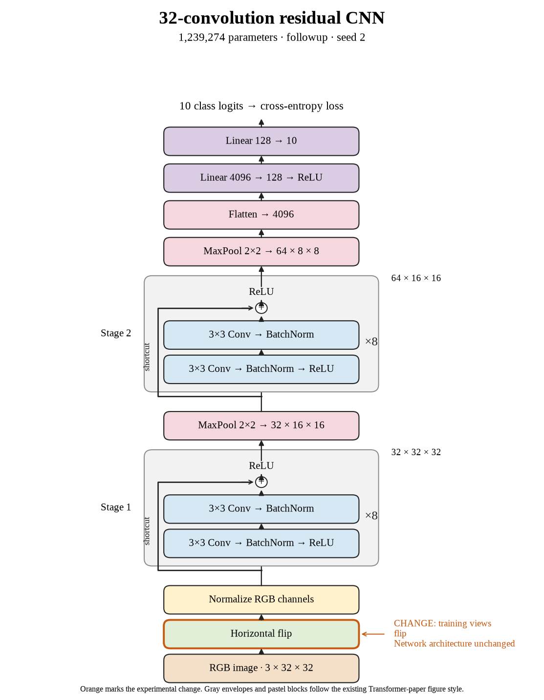

# 78. Do horizontal flips help the selected model on seed 2? (Oct 1, 2026)

<!-- experiment-key: followup/winner-flip/seed-2 -->

**TL;DR:** I reached 90.33% validation with horizontal flips on seed 2, gaining 2.99 points over the same architecture without augmentation.

**Problem.** The selected thirty-two-layer residual model still leaves a gap between training and validation accuracy. I want to improve performance on unseen images before changing its architecture again.

*How we know:* the no-augmentation seed-2 control scored 87.33% over its last ten epochs with nearly perfect clean training accuracy. I did not know how much horizontal flips would help this deeper model.

**Experiment.** I trained the same model from a fresh initialization for 160 epochs, randomly mirroring training images horizontally with probability 0.5. I kept seed 2, the 45,000/5,000 split, batch size 128, optimizer recipe, and all 1,239,274 parameters fixed; clean evaluation images were unchanged.

*What we hope to learn:* a gain would support learning from varied views of the same objects. No gain would suggest that mirroring alone is insufficient under this recipe.

**Outcome.** The final-ten-epoch validation score was 90.33%; final-epoch validation accuracy was 90.40%:

- Flips present the object facing either direction, like recognizing a car approaching from the left or right. They change training views without changing labels or adding network parameters.
- Clean training accuracy was 99.991%, while final validation loss fell from 0.519 to 0.388. Like passing fresh questions after practicing variants, validation improved without needing a higher training score.

Training plus clean evaluation took 34.8 minutes versus 35.3 for the control. All three flip seeds improved. Their mean validation score is 90.31%; crop-and-flip experiments provide the next comparison. This candidate was not selected for test evaluation.

**Takeaway:** Horizontal flips improved this fixed architecture across all three seeds. Training-view variation can matter even when clean training accuracy is already almost perfect.

Source: [completed run](https://wandb.ai/7adamyasingh-rutgers-university/cifar-activity/runs/0nh8k1w2), `runs/followup/winner-flip/seed-2/summary.json`; control: `runs/depth/residual/conv-32/seed-2/summary.json`.

<!-- experiment-architecture -->

Figure exports: [SVG](../../figures/experiments/followup-winner-flip-seed-2.svg) · [PDF](../../figures/experiments/followup-winner-flip-seed-2.pdf). Orange marks what changed; the diagram shows the trained architecture.
