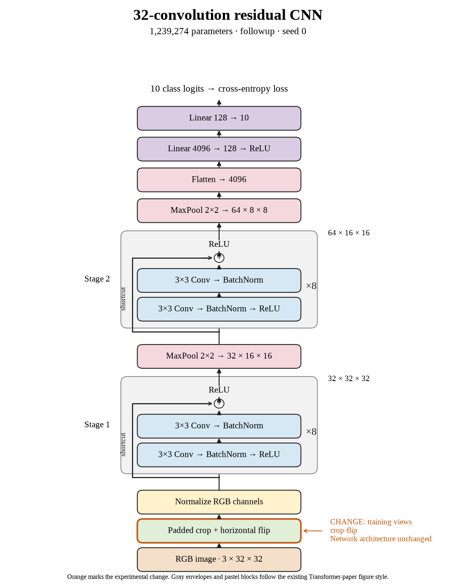

# 79. Do crops and flips improve the selected model on seed 0? (Oct 1, 2026)

<!-- experiment-key: followup/winner-crop-flip/seed-0 -->

**TL;DR:** I reached 93.67% validation with crops and flips on seed 0, gaining 5.98 points over the no-augmentation control.

**Problem.** Flips improved the selected architecture, but object position may still limit generalization. I want to test a richer training-view recipe while keeping the network fixed.

*How we know:* the no-augmentation seed-0 control scored 87.69%, and flips alone scored 90.33%. I needed to measure the added value of changing image position.

**Experiment.** I trained the same thirty-two-layer residual model for 160 epochs with random 32×32 crops after four-pixel padding and horizontal flips. I kept seed 0, the 45,000/5,000 split, batch size 128, optimizer recipe, and 1,239,274 parameters fixed; validation images remained clean.

*What we hope to learn:* a gain over flips would support adding positional variation. No gain would show that the extra image transformations did not help this architecture under the fixed recipe.

**Outcome.** The final-ten-epoch validation score was 93.67%; final-epoch validation accuracy was 93.78%:

- Random crops shift the visible content, like recognizing the same object after moving the photo within its frame. This encourages robustness to placement, though the score alone cannot prove which features changed.
- Clean training accuracy was 99.996%, while validation loss fell from 0.481 to 0.308. Like solving fresh questions after practicing rearranged examples, the improvement appears on held-out validation images.

Training plus clean evaluation took 34.8 minutes versus 35.4 for the control. This seed also beats flips alone by 3.34 points. The crop-and-flip group averages 93.74% validation, but ResNet-18 wins the follow-up selection. No test evaluation exists for this candidate.

**Takeaway:** Crops and flips improved the same network beyond flips alone. This is a training-recipe result, with architecture and parameter count held fixed.

Source: [completed run](https://wandb.ai/7adamyasingh-rutgers-university/cifar-activity/runs/koyu0eab), `runs/followup/winner-crop-flip/seed-0/summary.json`; control: `runs/depth/residual/conv-32/seed-0/summary.json`.

<!-- experiment-architecture -->

Figure exports: [SVG](../../figures/experiments/followup-winner-crop-flip-seed-0.svg) · [PDF](../../figures/experiments/followup-winner-crop-flip-seed-0.pdf). Orange marks what changed; the diagram shows the trained architecture.
