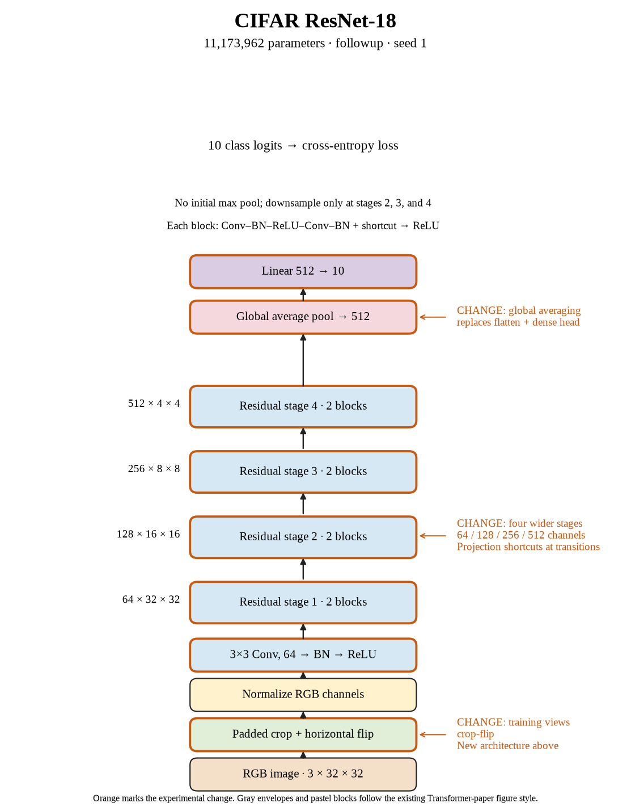

# 83. Does the ResNet-18 recipe improve seed 1? (Oct 1, 2026)

<!-- experiment-key: followup/resnet18-crop-flip/seed-1 -->

**TL;DR:** I reached 95.64% validation with CIFAR ResNet-18 on seed 1, 2.14 points above the crop-and-flip depth winner.

**Problem.** Crops and flips helped our custom architecture substantially. I want to see whether a standard, wider residual network can improve the result further within the queued training budget.

*How we know:* the same-seed crop-and-flip depth model scored 93.51%. The no-augmentation depth control scored 86.57%; it is a reference, not an architecture-only comparison.

**Experiment.** I trained CIFAR-adapted ResNet-18 from scratch for 200 epochs with crops and flips, using a 3×3 input convolution and no initial max-pooling. Seed 1, the 45,000/5,000 split, batch size 128, and SGD recipe stayed fixed, but architecture, parameter count, and training duration changed together.

*What we hope to learn:* a gain would justify this combined model-and-training recipe. No gain would suggest the larger network and extra epochs did not earn their cost here.

**Outcome.** The final-ten-epoch validation score was 95.64%; final-epoch validation accuracy was 95.68%:

- Four stages widen from 64 to 512 channels, with learned shortcuts at transitions, like adding wider workbenches and fitted connecting paths. Global average pooling summarizes each feature map before classification, replacing our dense hidden head.
- Clean training accuracy reached 100%; final validation loss was 0.172 versus 0.325. Like acing practice and making fewer costly mistakes on fresh questions, both final validation measures improved.

Training plus clean evaluation took 49.7 minutes versus 34.7 for the augmented depth model. This model has 11,173,962 parameters versus 1,239,274. The group wins selection at 95.77% mean validation; afterward this checkpoint scored 95.21% test accuracy with 0.185 test loss.

**Takeaway:** The complete ResNet-18 recipe wins this queue. I cannot attribute the improvement solely to architecture because capacity and training duration changed too.

Source: [completed run](https://wandb.ai/7adamyasingh-rutgers-university/cifar-activity/runs/0iyt7wel), `runs/followup/resnet18-crop-flip/seed-1/summary.json`; control: `runs/depth/residual/conv-32/seed-1/summary.json`. Augmentation-matched comparator: `runs/followup/winner-crop-flip/seed-1/summary.json`. Final test: `runs/followup/resnet18-crop-flip/seed-1/test-summary.json`.

<!-- experiment-architecture -->

Figure exports: [SVG](../../figures/experiments/followup-resnet18-crop-flip-seed-1.svg) · [PDF](../../figures/experiments/followup-resnet18-crop-flip-seed-1.pdf). Orange marks what changed; the diagram shows the trained architecture.
