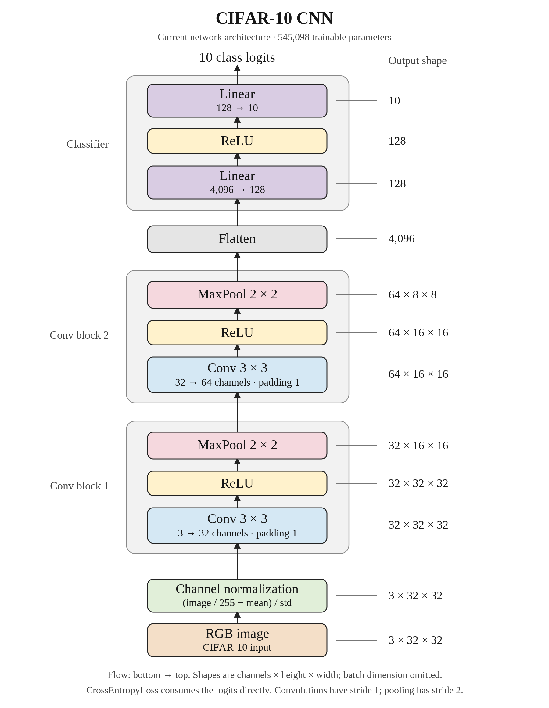

# CIFAR-10 research log

## Starting point — September 30, 2026

Our starting network is a small CNN with **545,098 trainable parameters**.
Each RGB image is scaled to 0–1 and normalized using CIFAR-10's channel
statistics before entering the network.

The first convolution block maps 3 input channels to 32 feature maps using a
3×3 convolution, ReLU, and 2×2 max pooling. The second block repeats those
operations with 64 feature maps. We flatten its 64×8×8 output into 4,096
features, then use a 128-unit hidden layer with ReLU and a final linear layer
that produces 10 class logits.

The template baseline uses SGD with learning rate **0.01**, batch size **64**,
seed **0**, and **10 epochs**. Cross-entropy loss consumes the logits directly.
This architecture is our reference for future experiments.

Figure exports: [SVG](figures/cifar_cnn_architecture.svg) ·
[PDF](figures/cifar_cnn_architecture.pdf).
The figure's visual style follows Figure 1 in
[Attention Is All You Need](https://arxiv.org/pdf/1706.03762).

Existing training and throughput measurements are recorded in
[BENCHMARKS.md](BENCHMARKS.md).

## Experiment 1 — data augmentation

Question: does changing the training views improve final clean test accuracy
with the existing two-convolution CNN and batch-512, 80-epoch recipe?
The historical unaugmented seed-0 reference reached 67.67% test accuracy;
this suite includes fresh paired controls rather than assuming that single run
represents the recipe's mean.

The fixed queue contains 15 recipes and three seeds (0, 1, 2), for 45 runs.
Start with 32×32 random crops after four pixels of black padding on all sides
and horizontal flips with probability 0.5. Include an unaugmented control and
separate crop/flip ablations. Add color jitter, rotation, erasing, MixUp, CutMix,
RandAugment, affine transforms, grayscale, blur, and CIFAR-10 AutoAugment
separately to crop + flip. Also test a resized-crop replacement with flip.

Keep SGD learning rate 0.01, batch 512, 80 epochs, eager FP32, the architecture,
normalization, and all 50,000 training examples fixed. Paired seeds share model
initialization and training order. Evaluate clean images; report epoch 80 for
every predefined recipe without selecting checkpoints or tuning strengths on
the test set. Results are exploratory comparisons using the existing test set.

Design: [experiment manifest](augmentation_experiments.json). The resumable
runner writes previews, per-run checkpoints and summaries, and an aggregate
report to `runs/augmentation/`. The report includes mean and sample standard
deviation, paired accuracy differences, clean train–test gaps, throughput, and
runtime. Final results will be recorded after the queue completes.

### Interim results — October 1, 2026

The first 14 completed runs have [individual research-log entries](notes/research-log/README.md).
Flip-only improved all three paired seeds, averaging 68.77% test accuracy
versus 67.96% without augmentation. Crop-only averaged 66.72%, and crop + flip
averaged 66.38%. Their smaller train–test gaps came with lower test accuracy.
The first two color-jitter additions changed crop + flip accuracy by +0.14 and
−0.04 points, while taking roughly 48 and 52 minutes of training/evaluation.
The third color-jitter seed was unfinished at this snapshot.

### Log maintenance — October 1, 2026

The [experiment index](notes/research-log/README.md) now covers all 45 completed
augmentation runs, the three historical full-training comparisons, and all
completed depth runs. Each entry includes a Transformer-paper-style architecture
diagram with orange callouts showing the experimental change, plus SVG/PDF
exports. The 14-run section above is an archived snapshot, not the live status.

A five-minute heartbeat checks for newly completed runs and writes each entry
with `summarize-experiment-as-adamya` and its voice corpus. The training queues
remain unchanged. Depth and follow-up entries use validation scores; historical
and augmentation entries use test accuracy. The current index links each note
and keeps those metrics separate.
